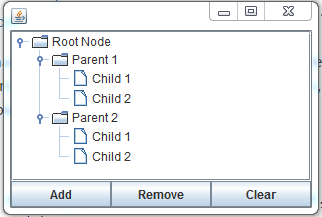
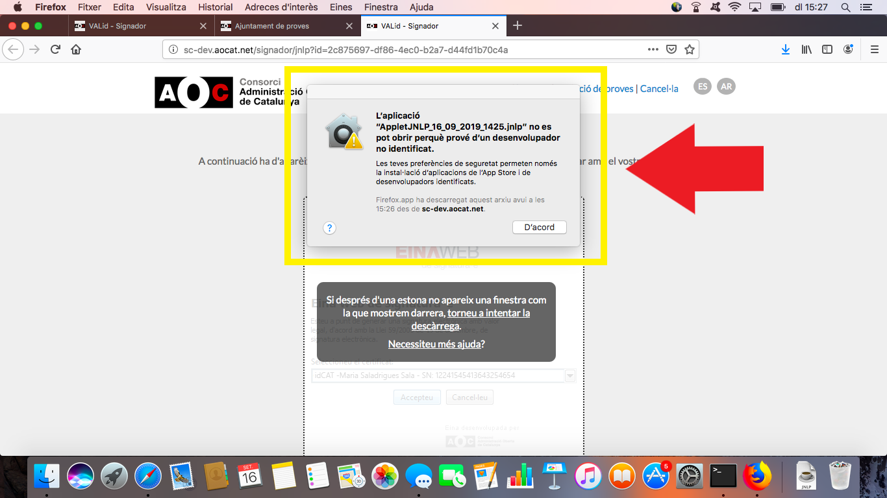
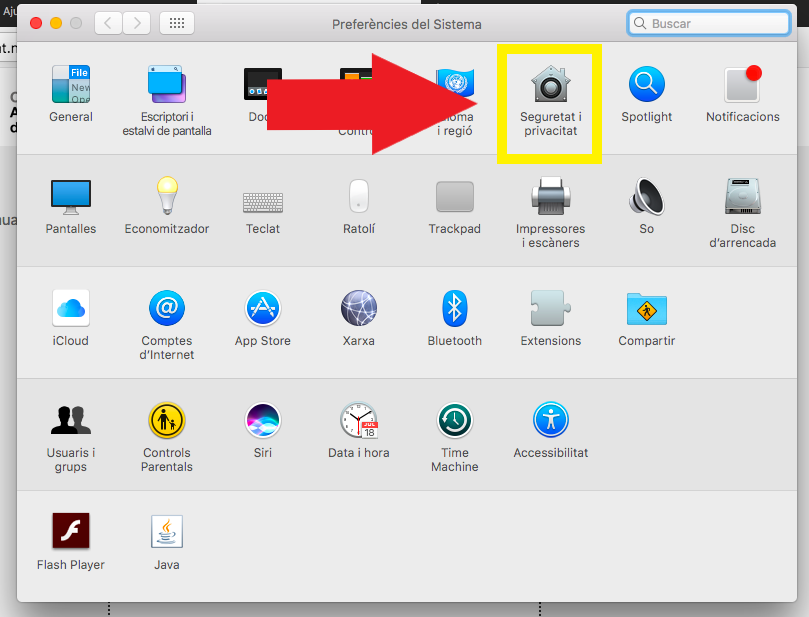
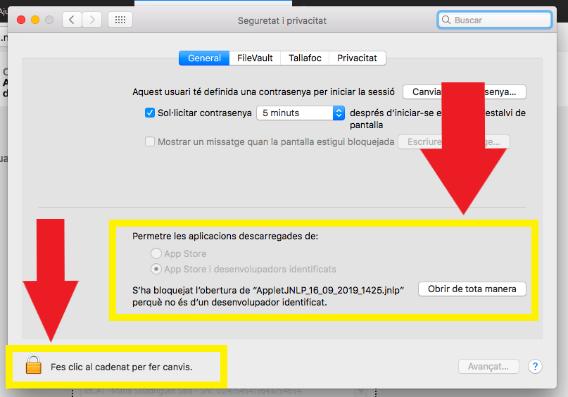
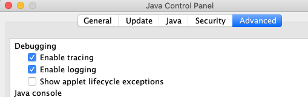
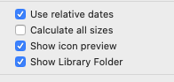

<h2>Com executar el <i>JNLP</i>?</h2>

Per tal de poder realitzar l'operació de signatura en si, un cop accedit al servei del **Signador** es descarregarà un fitxer amb extensió *.jnlp*. 
Per tal de dur a terme la signatura serà necessari executar aquest fitxer.

A diferència de l'applet de signatura el *JNLP* s'executa fora del context del navegador, per tant en aquest sentit hauria de funcionar independentment del navegador amb el que s'hagi descarregat el fitxer amb extensió *.jnlp*.

<h3>Sistemes operatius</h3>

Donem suport a l'execució del *JNLP* per a ser executat en els següents sistemes operatius:

 - *Ubuntu* - Versions [14.04 LTS i superiors](https://wiki.ubuntu.com/Releases) 
 - *Windows* - Versions client [7 i superiors](https://en.wikipedia.org/wiki/List_of_Microsoft_Windows_versions#Client_versions)
 - *Windows* - Versions servidor [Server 2008 i superiors](https://en.wikipedia.org/wiki/List_of_Microsoft_Windows_versions#Server_versions)
 - *MAC OS X* - Versions [OS.X 10.12 i superiors](https://en.wikipedia.org/wiki/MacOS#Release_history)
 
Indicar que aquest llistat s'anirà actualitzant, però no es donarà suport sobre sistemes operatius les versions dels quals hagin estat declarades obsoletes - [*EOL*](https://en.wikipedia.org/wiki/End-of-life_(product)) - per el propi fabricant.

**Nota**: Igual que en el cas dels navegadors pot funcionar en altres versions de sistemes operatius (e.g. altres distribucions de Linux com pot ser [Mint](https://www.linuxmint.com/)), però també igual que en el cas dels navegadors, aquestes altres versions no rebran suport per part nostra en cas de problemes d'execució.
 
<h3>Requeriments</h3>

És necessari tenir instal·lada una versió de la Java JRE en l'ordinador on volem executar el fitxer *.jnlp*. 
Donem suport fins a _tres versions anteriors_ a l'actual de JRE.

Pots descarregar-te [l'última versió de la JRE d'Oracle aquí](https://www.java.com/es/download/).

**Nota**: Si disposes d'un entorn/versió diferent dels especificats anteriorment es possible que igualment tot et funcioni correctament, però en cas de necessitar de suport només serà disponible per a les versions/entorns especificats.

<h3>Com utilitzar-ho</h3>

Si teniu problemes executant el _JNLP_ del signador podeu revisar la [FAQ oficial d'Oracle de com executar _JNLP_ aquí.](https://www.java.com/es/download/faq/java_webstart.xml)

Per comprovar que teniu tot correctament instal·lat podeu fer una prova [executant un _JNLP_ oficial d'Oracle d'exemple](https://docs.oracle.com/javase/tutorialJWS/samples/deployment/dynamictree_webstartJWSProject/dynamictree_webstart.jnlp), que en cas d'executar-se correctament mostra el següent pop-up:

Podeu veure aquest exemple i un altre [aqui](https://docs.oracle.com/javase/tutorial/deployment/webstart/examplesIndex.html).

### Problemes específics per a MAC OS X

En el cas de voler executar el _JNLP_ en un sistema operatiu _MAC OS X_ podem tenir alguna dificultat addicional ja que no disposem de les claus per tal de signar el fitxer _JNLP_ que distribuïm per a tal que ens reconeguin com a desenvolupadors identificats d'Apple. Per aquest motiu ens podem trobar que en un primer moment a l'hora d'anar a executar el fitxer, se'ns bloquegi l'execució mostrant el següent missatge:

Aleshores, serà necessari seguir les següents passes per tal de poder executar el _JNLP_ correctament.

Anar al `menú d'Apple` --> seleccionar `Preferències del sistema`:

Seleccionar `Seguretat i privacitat`, i revisar la pestanya `General` d'aquesta pantalla. Si apareix el botó `Obrir de tota manera`, simplement s'ha de clicar. Sinó, també potser que aparegui una opció addicional indicant l'execució d'aplicacions desconegudes, en aquest cas farà falta tocar el cadenat per a permetre la modificació i seleccionar aquesta opció. Un cop fet això, podem tornar a executar el _JNLP_ per a que es pugui executar correctament:

#### Logs de la JVM en MAC OS X
Per poder veure els logs de la JVM en MAC OS X, caldrà seguir els següents passos:
1. Activar les següents opcions del panell de control de java: 

2. Donar visibilitat al directori Library en el Finder.
Anar al directori home -> menú view -> show view options, i activar el checkbox de "Show library folder".

3. Els logs els tindrem en la següent ruta relativa a la home:

_Library/Application Support/Oracle/Java/Deployment/log_

