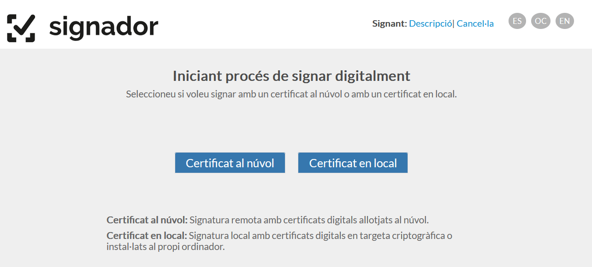
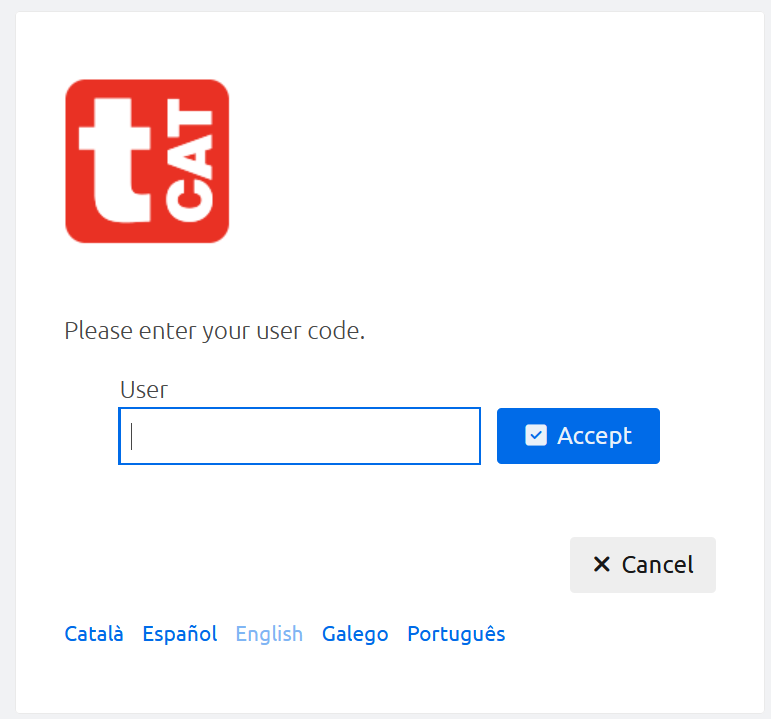
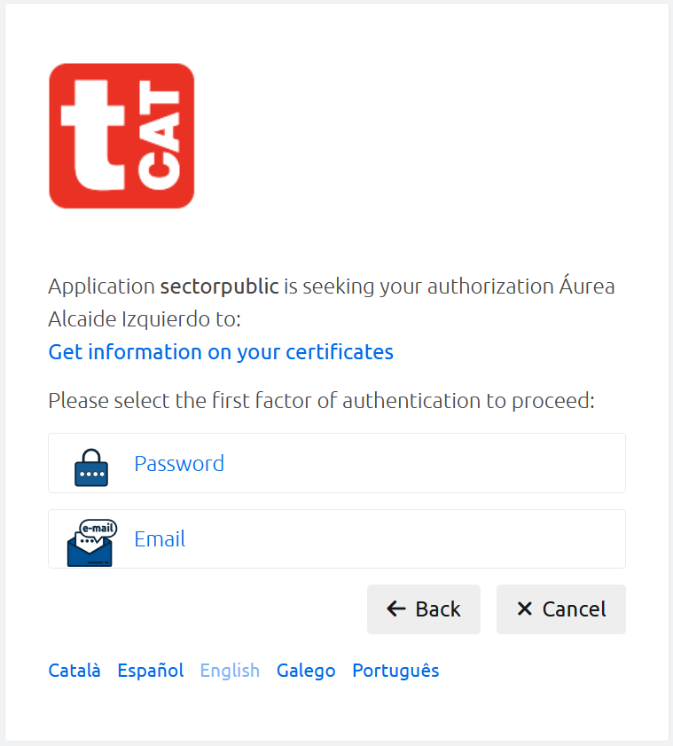
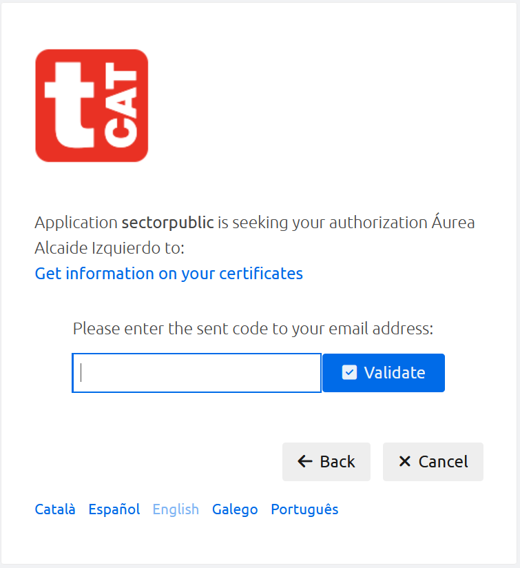
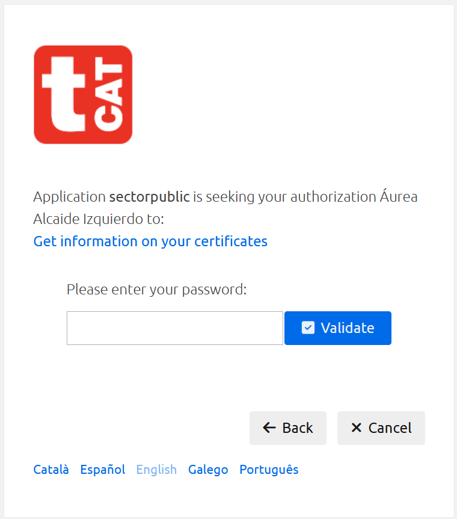
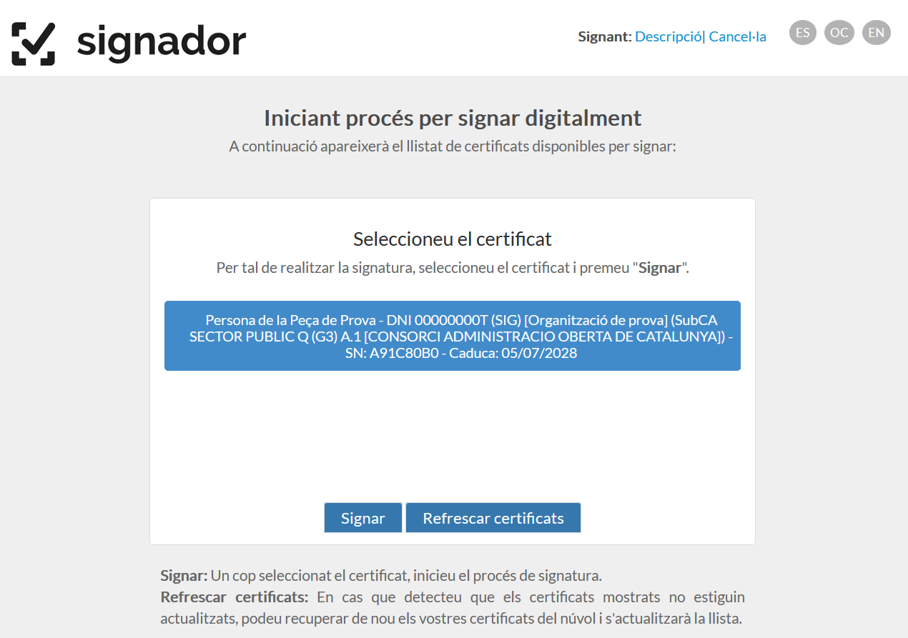
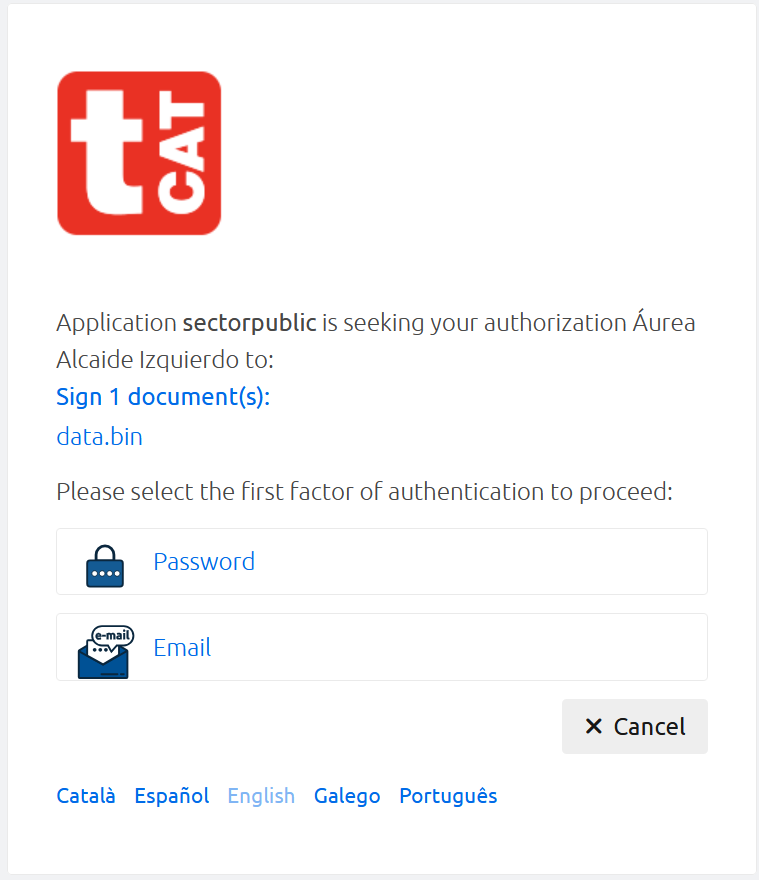
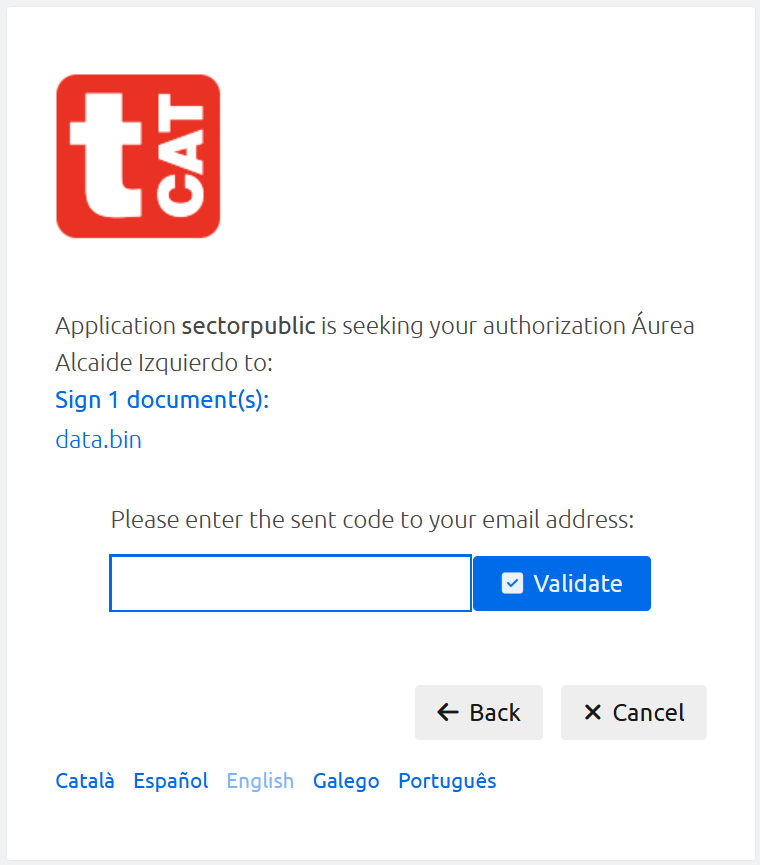
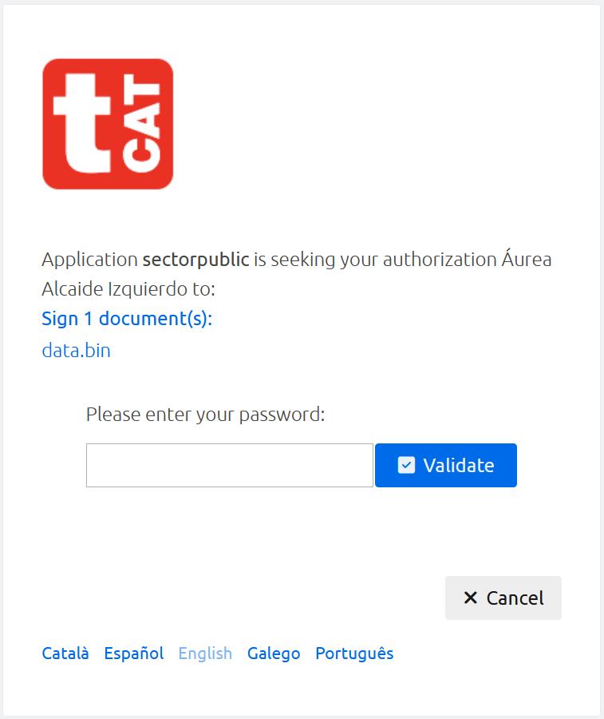

<!-- TOP-MENU-START -->
<nav class="site-topnav">
<a href="https://consorciaoc.github.io/signador/">SIGNADOR</a>
<a href="https://consorciaoc.github.io/signador/guiaUsuaris/nativa.html">NATIVA</a>
<a href="https://consorciaoc.github.io/signador/guiaUsuaris/jnlp.html">JNLP</a>
NATIVA MULTIUSUARIaviat<!-- Enllaç definitiu (activar quan estigui llest): <a href="https://consorciaoc.github.io/signador/multiUsuari/">NATIVA MULTIUSUARI</a> -->
<a href="https://consorciaoc.github.io/signador/guiaUsuaris/signaturaRemota.html" class="active">TCAT-RA</a>
</nav>

<!-- TOP-MENU-END -->

<!-- TOC-SIDEBAR-START -->

Índex<button id="docTocHide" title="Amaga l'índex" aria-label="Amaga l'índex">&#10094;</button>

<nav id="docTocNav" class="doc-toc__nav"></nav>

<button id="docTocShow" class="doc-toc__show" title="Mostra l'índex">&#9776; Índex</button>

<!-- TOC-SIDEBAR-END -->
<!-- TOC-HOME-OVERRIDE-START -->

<!-- TOC-HOME-OVERRIDE-END -->

# Signatura remota

_Signatura al núvol amb TCAT-RA · Integració i Manual d'usuari._

## 1. Sol·licitud del servei

Per tal que els usuaris d'una aplicació integrada amb Signador puguin fer ús de la signatura al núvol amb TCAT-RA (TCAT Remot + signatura Avançada), és necessari que l'ens responsable de l'aplicació integrada sol·liciti al Consorci AOC el permís per l'activació de la signatura al núvol per la seva aplicació al Signador.

Per tal de fer la sol·licitud, simplement cal demanar-ho a través del servei de Suport del Consorci AOC.

Un cop una aplicació ha obtingut el permís per fer ús de la signatura al núvol, a la primera plana del procés de signatura apareixerà la opció de signar amb certificats en local o al núvol:

La opció de "Certificat en local" farà ús de la Nativa o del JNLP per signar amb certificats digitals en targeta criptogràfica o instal·lats al propi ordinador de l'usuari.

La opció de "Certificat al núvol" permet la signatura amb certificats al núvol, en aquest cas certificats del servei TCAT-RA del Consorci AOC.

Recordem que per poder fer ús de la signatura al núvol és necessari que l'usuari en disposi d'un certificat TCAT-RA. Per sol·licitar-lo, poseu-vos en contacte amb el servei de Suport del Consorci AOC.

## 2. Nota per integradors

El procés de signatura remota no executa programari en la màquina de l'usuari. Per tant no en té accés. Amb la Nativa, en el cas de la signatura de documents en carpeta, els documents signats es guarden a la mateixa carpeta original. Amb la signatura remota això no és possible, i les signatures es retornen en un fitxer zip (de la mateixa manera que amb la signatura de múltiples documents).

## 3. Manual d'usuari

### 3.1. Primer accés a la signatura amb TCAT-RA

Quan parlem de primer accés, ens referim al primer cop que un usuari intenta signar amb la TCAT-RA. No ens referim al primer cop cada dia, per exemple, sinó únicament a la primera vegada que utilitzi la TCAT-RA mitjançant el Signador.

#### 3.1.1 L'usuari NO té cookie de sessió

Si l'usuari no ha iniciat sessió (és a dir, no ha fet servir mai la TCAT-RA des del Signador), en prémer "Certificat al núvol" se'l redirigeix cap al Servei de Signatura Remota (SSR en endavant) del Consorci AOC, per obtenir els seus certificats.

Autenticació de l'usuari en SSR per donar permís per obtenir la llista dels seus certificats. Primer se li demana el DNI a l'usuari (si ja ha accedit prèviament, es mostra el seu DNI directament al camp *User*):

Un cop insertat el DNI, continua el procés d'autenticació i autorització:

Un cop seleccionat el primer factor d'autenticació (*password* o *email*), s'enviarà un codi per correu electrònic a l'usuari, que haurà d'introduir en la següent pantalla:

Un cop introduït el codi a la pantalla anterior, se li demanarà a l'usuari que introdueixi les dades per autenticar-se. Per exemple, en cas que prèviament hagués seleccionat *Password*, se li demanarà d'introduir el seu password de la TCAT-RA:

Un cop l'usuari autoritza la obtenció d'informació sobre els seus certificats, es mostra ja la pantalla amb la llista dels certificats que tingui disponibles a la TCAT-RA per signar. Per exemple:

#### 3.1.2. L'usuari SÍ té cookie de sessió

Això vol dir que l'usuari prèviament ja ha obtingut informació dels seus certificats segons el procés descrit a l'apartat anterior.

En aquest cas la pantalla inicial serà directament aquesta, sense necessitat d'autenticació en SSR:

### 3.2. Refrescar certificats

Si en algun moment l'usuari vol de nou recuperar els seus certificats des de la TCAT-RA, podrà fer-ho clicant aquest botó. El procés serà el mateix que el descrit a l'apartat 2.1. Es recuperaran els seus certificats carregats a la TCAT-RA, i la informació sobre aquests s'actualitzarà als sistemes Signador.

### 3.3. Signatura

El procés de signatura inclou autenticació i autorització en SSR, per part de l'usuari.

Un cop l'usuari clica en el botó "Signar", se li redirigirà cap a SSR per a que doni el seu consentiment per realitzar la signatura. Els passos són els mateixos que en el cas de la recuperació dels certificats, si bé en aquest cas el procés que s'autoritza és la generació de la signatura.

Un cop fet això, el procés de signatura continuarà de la mateixa manera que amb la resta de certificats (és a dir, de la mateixa manera que amb Nativa/JNLP).
