<!-- TOP-MENU-START -->
<nav class="site-topnav">
<a href="https://consorciaoc.github.io/signador/">SIGNADOR</a>
<a href="https://consorciaoc.github.io/signador/guiaUsuaris/nativa.html">NATIVA</a>
<a href="https://consorciaoc.github.io/signador/guiaUsuaris/jnlp.html">JNLP</a>
<span class="soon" title="Properament (encara no disponible)">TCAT-RA<span class="b">aviat</span></span>
</nav>
<style>
body{padding-top:54px}
.site-topnav{position:fixed;top:0;left:0;right:0;height:54px;display:flex;align-items:stretch;gap:2px;background:#10303f;z-index:1100;padding:0 8px;font-family:"Open Sans",Helvetica,Arial,sans-serif}
.site-topnav a{display:flex;align-items:center;color:#dfe8ee;text-decoration:none;padding:0 20px;font-weight:600;font-size:.9rem;letter-spacing:.03em;border-bottom:3px solid transparent}
.site-topnav a:hover{background:#15425a;color:#fff}
.site-topnav a.active{color:#fff;background:#15425a;border-bottom-color:#2bbf86}
.site-topnav .soon{display:flex;align-items:center;padding:0 20px;font-weight:600;font-size:.9rem;letter-spacing:.03em;color:#8a98a3;cursor:default}
.site-topnav .soon .b{font-size:.6rem;background:#2bbf86;color:#04331f;border-radius:9px;padding:1px 7px;margin-left:7px}
#docToc{top:54px !important;height:calc(100vh - 54px) !important}
.doc-toc__show{top:64px !important}
.page-header{padding-top:1.33rem !important;padding-bottom:1.33rem !important}
</style>
<!-- TOP-MENU-END -->

# Manual d'instal·lació — Nativa Multiusuari (Windows)

_Instruccions d'instal·lació de l'aplicació APP Signador Nativa en mode Multiusuari en entorn Windows._

<!-- TOC-SIDEBAR-START -->
<div id="docToc" class="doc-toc">
<div class="doc-toc__head"><span>Índex</span><button id="docTocHide" title="Amaga l'índex" aria-label="Amaga l'índex">&#10094;</button></div>
<nav id="docTocNav" class="doc-toc__nav"></nav>
<div id="docTocResize" class="doc-toc__resize" title="Arrossega per canviar l'amplada"></div>
</div>
<button id="docTocShow" class="doc-toc__show" title="Mostra l'índex">&#9776; Índex</button>
<style>
:root{--toc-w:300px}
html{scroll-behavior:smooth}
body{transition:margin-left .2s ease}
body.toc-open{margin-left:var(--toc-w)}
#docToc{position:fixed;top:0;left:0;height:100vh;width:var(--toc-w);background:#fafbfc;border-right:1px solid #e1e4e8;display:flex;flex-direction:column;z-index:1000;font-family:"Open Sans",Helvetica,Arial,sans-serif;font-size:.85rem;transition:transform .2s ease}
body.toc-closed #docToc{transform:translateX(-100%)}
#docToc .doc-toc__head{display:flex;align-items:center;justify-content:space-between;padding:.7rem 1rem;font-weight:700;color:#159957;border-bottom:1px solid #e1e4e8;background:#fff}
#docToc .doc-toc__head button{border:0;background:transparent;cursor:pointer;font-size:1rem;color:#586069}
#docToc .doc-toc__home{display:flex;align-items:center;padding:.5rem 1rem;color:#1e6bb8;text-decoration:none;border-bottom:1px solid #e1e4e8;font-size:.85rem;font-weight:600;letter-spacing:.03em;background:#fff}
#docToc .doc-toc__home:hover{background:#eef3f8;text-decoration:underline}
#docToc .doc-toc__home-ico{width:1.2em;height:1.2em;margin-right:.45rem;flex:0 0 auto}
#docTocNav{overflow:auto;padding:.4rem .25rem;flex:1}
#docTocNav ul{list-style:none;margin:0;padding:0}
#docTocNav ul ul{padding-left:.7rem}
#docTocNav .toc-row{display:flex;align-items:flex-start}
#docTocNav .toc-toggle{flex:0 0 1.1rem;width:1.1rem;border:0;background:transparent;cursor:pointer;color:#959da5;font-size:.7rem;line-height:1.7;padding:0;visibility:hidden}
#docTocNav li.has-children>.toc-row>.toc-toggle{visibility:visible}
#docTocNav .toc-toggle::before{content:"\25BE"}
#docTocNav li.collapsed>.toc-row>.toc-toggle::before{content:"\25B8"}
#docTocNav li.collapsed>ul{display:none}
#docTocNav .toc-link{display:block;flex:1;padding:.22rem .4rem;color:#586069;text-decoration:none;border-left:3px solid transparent;line-height:1.35}
#docTocNav .toc-link:hover{background:#eef3f8;border-left-color:#159957}
#docTocNav li.has-children>.toc-row>.toc-link{color:#000;font-weight:600}
#docTocNav li.lvl3>.toc-row>.toc-link{color:#000;font-weight:600}
#docTocNav li.lvl4>.toc-row>.toc-link{font-size:.82rem}
#docTocNav li.lvl5>.toc-row>.toc-link,#docTocNav li.lvl6>.toc-row>.toc-link{font-size:.8rem}
#docTocNav li.lvl2{border-top:1px solid #e1e4e8;margin-top:.35rem;padding-top:.15rem}
#docTocNav>ul>li.lvl2:first-child{border-top:0;margin-top:0;padding-top:0}
#docTocNav li.lvl2>.toc-row>.toc-link{font-weight:700;color:#159957;text-transform:uppercase;font-size:.78rem;letter-spacing:.04em}
#docTocNav li.lvl2>.toc-row>.toc-link:hover{background:#eaf5ef}
.doc-toc__resize{position:absolute;top:0;right:-3px;width:6px;height:100%;cursor:col-resize}
.doc-toc__show{position:fixed;top:10px;left:10px;z-index:1001;display:none;border:1px solid #d1d5da;background:#fff;color:#159957;border-radius:4px;padding:.35rem .6rem;cursor:pointer;font-weight:600;box-shadow:0 1px 3px rgba(0,0,0,.12)}
body.toc-closed .doc-toc__show{display:block}
@media(max-width:42em){body.toc-open{margin-left:0}#docToc{width:min(85vw,320px)}}
</style>
<script>
(function(){
function init(){
var nav=document.getElementById('docTocNav');
if(!nav)return;
var scope=document.querySelector('.main-content')||document.body;
var hs=[].slice.call(scope.querySelectorAll('h2,h3,h4,h5,h6')).filter(function(h){return !h.closest('#docToc');});
if(!hs.length)return;
var rootUl=document.createElement('ul');
var stack=[{level:1,ul:rootUl}];
hs.forEach(function(h){
 var level=parseInt(h.tagName.substring(1),10);
 if(!h.id){h.id=h.textContent.trim().toLowerCase().replace(/[^a-z0-9 -]/g,'').replace(/\s+/g,'-');}
 while(stack.length>1 && stack[stack.length-1].level>=level){stack.pop();}
 var parent=stack[stack.length-1];
 var li=document.createElement('li');
 li.className='toc-li lvl'+level;
 li.setAttribute('data-id',h.id);
 var row=document.createElement('div');row.className='toc-row';
 var btn=document.createElement('button');btn.className='toc-toggle';btn.type='button';btn.setAttribute('aria-label','Desplega/replega');
 var a=document.createElement('a');a.href='#'+h.id;a.className='toc-link';a.textContent=h.textContent.trim();
 row.appendChild(btn);row.appendChild(a);li.appendChild(row);
 parent.ul.appendChild(li);
 var childUl=document.createElement('ul');li.appendChild(childUl);
 stack.push({level:level,ul:childUl,li:li});
});
rootUl.querySelectorAll('li.toc-li').forEach(function(li){
 var c=li.querySelector(':scope > ul');
 if(c && c.children.length){li.classList.add('has-children');}
 else if(c){c.parentNode.removeChild(c);}
});
nav.appendChild(rootUl);
function loadC(){try{return JSON.parse(localStorage.getItem('docTocCollapsed')||'[]');}catch(e){return [];}}
function saveC(){var ids=[];rootUl.querySelectorAll('li.has-children.collapsed').forEach(function(x){ids.push(x.getAttribute('data-id'));});try{localStorage.setItem('docTocCollapsed',JSON.stringify(ids));}catch(e){}}
var col=loadC();
rootUl.querySelectorAll('li.has-children').forEach(function(li){if(col.indexOf(li.getAttribute('data-id'))>=0)li.classList.add('collapsed');});
nav.addEventListener('click',function(e){var b=e.target.closest('.toc-toggle');if(!b)return;e.preventDefault();b.closest('li.toc-li').classList.toggle('collapsed');saveC();});
var body=document.body;
function setOpen(o){body.classList.toggle('toc-open',o);body.classList.toggle('toc-closed',!o);try{localStorage.setItem('docTocOpen',o?'1':'0');}catch(e){}}
document.getElementById('docTocHide').onclick=function(){setOpen(false);};
document.getElementById('docTocShow').onclick=function(){setOpen(true);};
var saved=null;try{saved=localStorage.getItem('docTocOpen');}catch(e){}
setOpen(saved!=='0');
var root=document.documentElement,w=null;try{w=localStorage.getItem('docTocW');}catch(e){}
if(w){root.style.setProperty('--toc-w',w+'px');}
var rz=document.getElementById('docTocResize'),drag=false;
rz.addEventListener('mousedown',function(e){drag=true;e.preventDefault();document.body.style.userSelect='none';});
window.addEventListener('mousemove',function(e){if(!drag)return;var nw=Math.min(560,Math.max(180,e.clientX));root.style.setProperty('--toc-w',nw+'px');});
window.addEventListener('mouseup',function(){if(!drag)return;drag=false;document.body.style.userSelect='';var cur=getComputedStyle(root).getPropertyValue('--toc-w').trim().replace('px','');try{localStorage.setItem('docTocW',cur);}catch(e){}});
}
if(document.readyState==='loading'){document.addEventListener('DOMContentLoaded',init);}else{init();}
})();
</script>
<!-- TOC-SIDEBAR-END -->

## Introducció

El present document té com a públic objectiu, personal de sistemes i suport de nivell 2 pels usuaris finals de l’eina Signador a entorns Windows multiusuari.

La distribució del document consisteix en 4 grans grups:

  - Introducció: descripció del present document, abast del mateix i descripció dels apartats.

  - Instal·lació: requisits mínims, procés d’instal·lació i detalls sobre la configuració.

  - Execució: detalls dels diferents components que conformen l’aplicació, com executar-los, aturar-los i la seva funció.

  - Traçabilitat: apartat on es defineix els sistemes de traçabilitat, així com exemples de traces.

## Instal·lació

Aquest apartat descriu els requisits previs i el procediment necessari per instal·lar correctament **APP Nativa Signador Multiusuari** en un entorn Windows.

S’hi inclouen:

  - Els **requeriments mínims de sistema i permisos necessaris** per dur a terme la instal·lació.

  - La descripció **pas a pas** del procés d’instal·lació, amb les diferents pantalles que apareixen a l’assistent i les opcions que cal triar.

  - Les **configuracions específiques dels components** de l’aplicació, definides mitjançant fitxers de propietats.

### Requeriments

Abans de dur a terme la instal·lació, cal verificar que l’equip compleix els requisits mínims i que l’usuari disposa dels permisos necessaris.

#### Requeriments de sistema

Per garantir la correcta instal·lació i execució de l’aplicació, l’equip ha de complir uns requisits mínims de hardware i programari:

  - **Processador**: Arquitectura x86 (32 bits) o x64 (64 bits). L’executable a seleccionar dependrà de l‘arquitectura del processador (32 o 64 bits).

  - **Memòria RAM**: Mínim recomanat de **2 GB**.

  - **Espai en disc**: Aproximadament **200 MB** lliures.

  - **Sistema operatiu**: Windows 7 o superior, en versions de 32 o 64 bits.

  - **Navegador**: Per a la integració amb el Signador.

  - **Connexió a Internet**.

#### Permisos necessaris

La instal·lació requereix l’execució amb **permisos d’administrador**. Durant el procés, Windows mostra la finestra de **Control de comptes d’usuari (UAC)**, on cal prémer **Sí** per continuar.

Aquests permisos són necessaris per:

  - Escriure fitxers a *C:\Program Files\...* o a la carpeta d’instal·lació definida.

  - Crear dreceres al menú *Inici* i, si escau, a l’escriptori.

  - Registrar protocols propis del sistema (*signador://*).

### Pas a pas

En aquest apartat es descriu detalladament el procés d’instal·lació de la **Nativa Multiusuari** en sistemes *Windows*.

#### Instal·lador

Abans d’iniciar el procés, és necessari verificar si l’equip on s’instal·larà l’aplicació, utilitza una arquitectura de **32 bits** o **64 bits**, ja que l’executable varia en funció d’aquest paràmetre:

  - En equips amb arquitectura **32 bits**, cal executar el fitxer:

**ANSm_windows-x32_2_0_0_0.exe**.

  - En equips amb arquitectura **64 bits**, cal executar el fitxer:

**ANSm_windows-x64_2_0_0_0.exe**.

#### Selecció de l’idioma

Un cop iniciada l’execució del fitxer corresponent, apareixerà la pantalla per triar l’idioma de l’assistent d’instal·lació. Els idiomes disponibles són **català**, **castellà** i **anglès**.

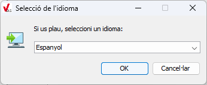

Seleccioneu l’opció desitjada i feu clic a **OK** per continuar.

#### Pantalla de benvinguda

Un cop seleccionat l’idioma, el sistema operatiu Windows pot mostrar una finestra sol·licitant permisos d’administrador (Control de comptes d’usuari - UAC).

És necessari prémer l’opció **Sí** per continuar amb la instal·lació.

A continuació, es mostra la pantalla de Benvinguda de l’assistent. On s’informa que el programa serà instal·lat a l’ordinador.

Feu clic a **Següent** per iniciar el procés, o **Cancel·lar** si voleu interrompre la instal·lació.

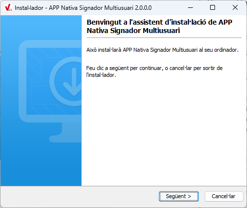

#### Tasques addicionals

En aquesta pantalla es mostren opcions addicionals relacionades amb la configuració de l’aplicació.

Per defecte, es proposa realitzar la configuració necessària per a l’ús de l’aplicació Nativa del Signador en el navegador **Firefox**.

  - Si utilitzeu habitualment **Firefox** per signar, deixeu marcada l’opció.

  - Si no feu servir **Firefox**, podeu desmarcar-la. En aquest cas, serà possible configurar-ho més endavant si fos necessari.

Feu clic a **Següent** per continuar.

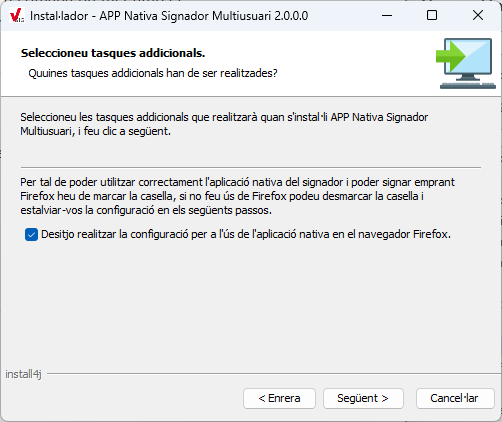

#### Selecció del directori de Firefox

En cas d’haver activat l’opció de configuració per a l’ús de l’aplicació Nativa en **Firefox**, es mostra aquesta pantalla per identificar el directori on està instal·lat el navegador.

  - El camp mostra, de manera predeterminada, la ruta habitual d’instal·lació de Firefox (C:\Program Files\Mozilla Firefox).

  - Si el navegador està instal·lat en un altre directori, utilitzeu el botó **Explorar** per localitzar la carpeta corresponent.

Un cop confirmada la ruta, feu clic a **Següent** per continuar.

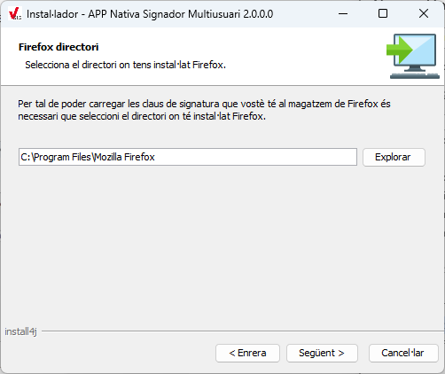

#### Configuració de les dreceres al menú Inici

En aquesta pantalla es pot indicar com es crearan els accessos directes a l’aplicació dins del menú *Inici* de Windows.

  - Per defecte, s’habilita l’opció **Crear una carpeta en el menú d’inici**, amb el nom *APP Nativa Signador Multiusuari*. Es pot modificar aquest nom si es vol, o bé seleccionar una carpeta existent que es mostra en el llistat posterior.

  - També es pot activar l’opció **Crear tecles de mètode abreujat per a tots els usuaris**, la qual permet generar dreceres accessibles per a tots els comptes de Windows de l’equip.

Un cop realitzada la configuració, feu clic a **Següent** per continuar amb la instal·lació.

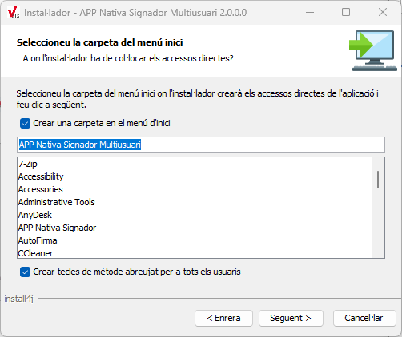

#### Procés d’instal·lació

En aquest punt, l’instal·lador inicia la còpia i configuració del fitxers necessaris per a **APP Nativa Signador Multiusuari.**

  - A la finestra es mostra una **barra de progrés** que reflecteix l’estat de la instal·lació.

  - Durant aquest procés, poden aparèixer missatges informatius amb els noms dels fitxers que s’estan extraient i instal·lant.

  - La durada d’aquesta fase pot variar en funció de les prestacions de l’equip i de la càrrega de treball en aquell moment.

En el cas de que es produeixi algun error:

  - Es mostrarà una finestra amb la informació corresponent.

  - La instal·lació s’interromprà i es desfarà automàticament qualsevol canvi aplicat fins al moment, retornant el sistema a l’estat anterior.

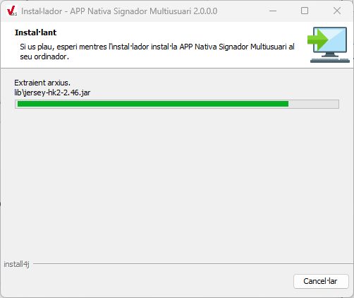

#### Resum de la instal·lació

Un cop completat el procés, l’instal·lador mostra una pantalla de **resum** que confirma que la instal·lació s’ha realitzat correctament.

En aquesta finestra s’indica:

  - El directori d’instal·lació on s’ha desat l’aplicació.

  - El registre del nou protocol personalitzat associat a l’aplicació (signador://<id_sessio>).

Reviseu la informació mostrada i feu clic a **Següent** per continuar.

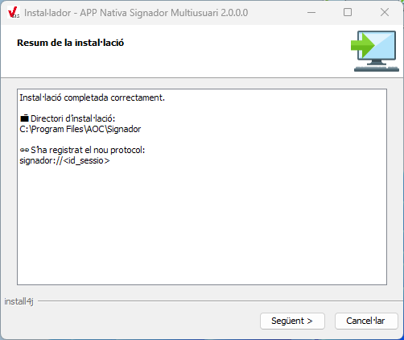

#### Finalització de la instal·lació

La darrera pantalla confirma que la instal·lació de **APP Nativa Signador Multiusuari** s’ha completat correctament.

Per sortir de l’assistent, feu clic a **Finalitzar**.

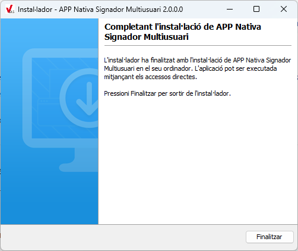

## Execució

### Servei Broker (Broker.exe)

El **Broker** és un dels components clau de la nova **Nativa Multiusuari**. S’instal·la automàticament com a **servei de Windows** i actua com a intermediari entre **els navegadors dels usuaris** i les instàncies de la Nativa.

#### Inici/aturada

El servei **Broker** s’instal·la automàticament amb l’aplicació com a **servei Windows** amb el nom **Broker**.

Per tal d’aturar o parar el servei haurem d’operar com a qualsevol altre servei de Windows.

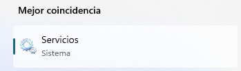

1.  Obrir el gestor de serveis, escrivint service.msc al menú d’inici de Windows, o bé cercar “Serveis” o “Servicios” en funció de l’idioma del Sistema Operatiu.

2.  Localitzar el servei amb el nom **Broker**.

3.  Clicant amb el botó dret del ratolí sobre el servei es mostren les opcions:
    
    1.  **Inicia** arrenca el servei.
    
    2.  **Atura** para el servei.
    
    3.  **Reinicia** atura i arrenca de nou el servei.

#### Monitorització d’activitat

El servei **Broker** utilitza per defecte el **rang de ports TCP 9090-9095**.

Quan arrenca, selecciona el primer port disponible dins d’aquest rang. En el cas de que no hi hagi cap port lliure en aquest rang, el Broker no s’inicialitzarà.

A més de les formes convencionals per veure el port d’un procés, aquest hauria de quedar reflectit als logs, i seguint les següents passes ho podrem comprovar.

1.  Obrim el fitxer de log del Broker (C:\Program Files\AOC\Signador\log\**Broker.log**)

2.  Buscar el missatge d’inicialització del servidor d’aplicacions (*Server arrencat correctament.*) i identificar el port en ús (*Started ServerConnector@....{0.0.0.0:_port_}*)

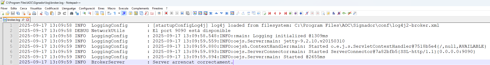

**Endpoints de diagnosi**

El Broker disposa d’un endpoint REST de diagnosi anomenat **/ping**, que permet comprovar de manera senzilla si el servei està aixecat i responent correctament. Aquest endpoint es pot consultar des d’un navegador web o amb eines de línia de comandes com *curl*.

1.  Obrir qualsevol navegador.

2.  Introduir l’adreça: [***https://nativa.aoclocal.cat:909X/ping***](https://nativa.aoclocal.cat:909X/ping)

NOTA: Aquest URL aoclocal.cat és el servidor qui la ressol com a 127.0.0.1.

On 909X correspon al port actiu del servei Broker (rang possible 9090-9095). Una resposta correcta confirma que el servei està en execució.

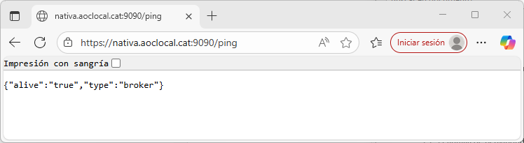

### Actualització certificats Nativa (*NativaCertificateUpdater.exe*)

Durant la instal·lació de l’aplicació, es genera i s’instal·la automàticament un **certificat arrel autosignat**, que s’utilitza per assegurar les comunicacions HTTPS entre els components de la nova Nativa Multiusuari. Aquest certificat s’importa tant als magatzems interns de l’aplicació com al sistema operatiu, perquè sigui reconegut de forma transparent pels navegadors i per l’entorn Java.

L’eina ***NativaCertificateUpdater.exe*** permet repetir aquest procés en cas necessari (per exemple, si el certificat ha caducat o ha quedat invalidat), regenerant-lo i actualitzant els magatzems corresponents.

#### Actualització del certificat

En condicions normals no és necessari executar manualment l’eina de regeneració, ja que el certificat autosignat es crea durant la instal·lació. Tot i així, en cas que el certificat hagi **caducat** o **resulti invàlid**, es pot renovar seguint aquest procediment:

1.  **Aturar el servei Broker**
    
      - Obrir el Gestor de Serveis de Windows.
    
      - Localitzar el servei Broker i fer clic a **Atura**.

2.  **Aturar qualsevol instància del Signador**
    
      - Obrir l’administrador de tasques de Windows. A detalls, localitzar els processos **Signador.exe**.
    
      - Desplegar el menú d’opcions clicant sobre el procés amb el botó dret i clicar a “Finalitzar tasca”.

3.  **Executar l’eina *NativaCertificateUpdater.exe***
    
      - Anar al directori d’instal·lació de la Nativa Multiusuari.
    
      - Executar ***NativaCertificateUpdater.exe*** amb permisos d’administrador.
    
      - L’eina comprovarà l’estat del certificat actual i, si ha caducat o és invàlid, en generarà un de nou i l’importarà als magatzems corresponents.

4.  **Reiniciar el servei Broker**.
    
      - Tornar al *Gestor de Serveis*.
    
      - Seleccionar el servei Broker i fer clica **Inicia**.

### Nativa Multiusuari (Signador.exe)

La **Nativa Multiusuari** és l’executable ***Signador.exe***. Aquest component és l’encarregat d’accedir als certificats de l’usuari i realitzar les operacions de signatura.

#### Inici/aturada

**Inici**

El procés de la Nativa Multiusuari no s’arrenca manualment com un servei de Windows, sinó que es gestiona **automàticament a demanda des del navegador** (applet de signatura):

1.  Quan l’usuari inicia un procés de signatura des de l’applet i **no hi ha cap instància activa** de la Nativa, o bé l’**identificador de sessió** calculat no es troba dins del registre de sessions del Broker, es mostra una pantalla amb el botó “**Iniciar Sessió**”.

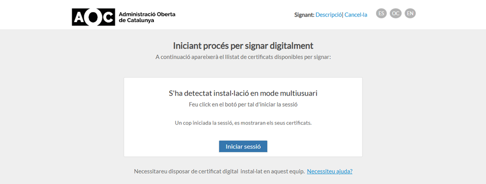

2.  En fer clic a Iniciar sessió, el navegador invoca el protocol personalitzat: **signador://<id_sessió>**

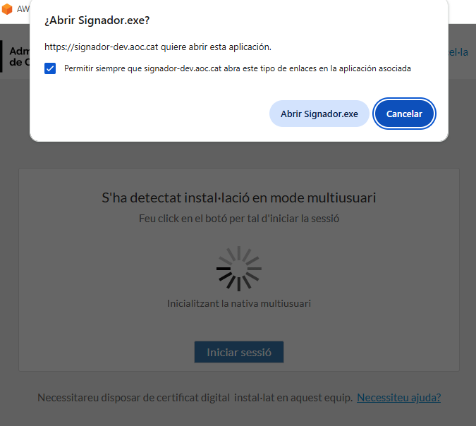

3.  Aquesta crida llança el procés ***Signador.exe*** amb *<id_sessió>* com a argument, i inicialitza la Nativa Multiusuari, en el **primer port lliure disponible** del rang establert (≥9096) i envia al Broker la petició per enregistrar la nova parella *id_sessio/port*.

4.  La instància queda arrencada i preparada per atendre el **servei de Signador**.

**En cas d’error o absència d’instància activa**

Si *Signador.exe* no es pot inicialitzar o no està actiu en el moment de la signatura, es mostra un missatge d’error al navegador indicant “**No s’ha pogut connectar amb la Nativa”**.

A continuació, es torna a mostrar la pantalla amb el botó **Iniciar sessió**, que avisa l’usuari que ha de reiniciar la sessió fent clic de nou en aquest botó.

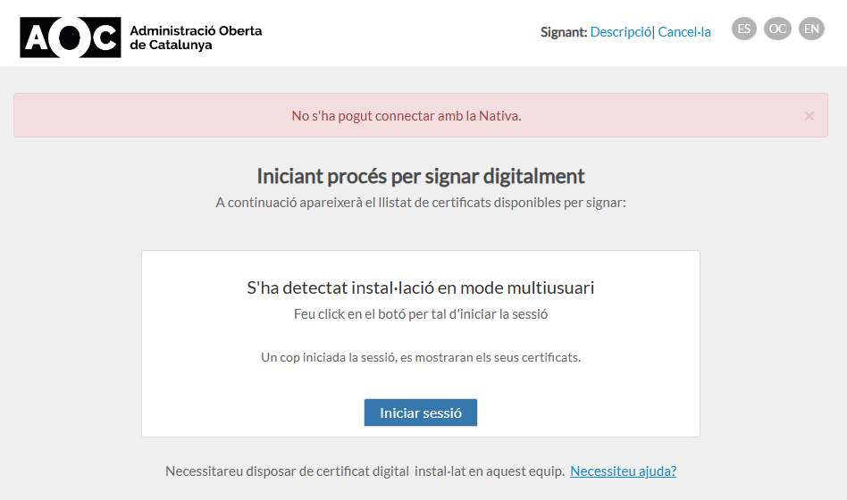

**Aturada**

La instància de **Nativa Multiusuari** no disposa d’un mecanisme específic per aturar-se manualment. El procés ***Signador.exe*** sempre roman actiu tot i que s’aturi el servei del Broker.

Per tant, en cas necessari, s’ha de **forçar l’aturada** des de l’**Administrador de Tasques de Windows.**

#### Monitorització d’activitat

La Nativa Multiusuari utilitza per defecte el rang de ports TCP **9096 en endavant**, assignant un port a cada usuari que inicia una nova instància de la Nativa.

Per disseny, només hi ha una instància de ***Signador.exe*** per usuari. En cas d’intentar nous llançaments només quedarà actiu el primer d’ells, enregistrant l’identificador de sessió al Broker.

Per consultar els ports actius, a més de les formes convencionals, podem mirar als logs, obrint el fitxer de log de la Nativa (C:\Program Files\AOC\Signador\log\**webappTemp.log**)

1.  Buscar el missatge d’inicialització del servidor d’aplicacions (*Server arrencat correctament.*) i identificar el port en ús.

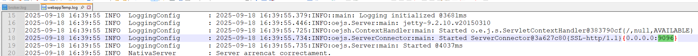

**Endpoints de diagnosi**

La Nativa disposa d’un endpoint REST de diagnosi anomenat ***/ping***, que permet comprovar de manera senzilla si el servei està aixecat i responent correctament. Aquest endpoint es pot consultar des d’un navegador web o amb eines de línia de comandes com *curl*.

1.  Obrir qualsevol navegador.

2.  Introduir l’adreça: https://nativa.aoclocal.cat:909X/ping

On 909X correspon al port actiu de la Nativa (rang possible: 9096 en endavant). Una resposta correcta confirma que el servei està en execució.

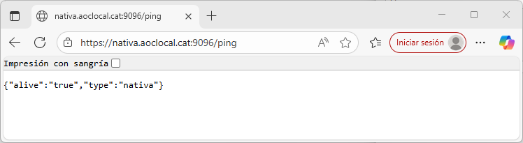

## Connectivitat

La solució **Nativa Multiusuari** es basa en una arquitectura client–servidor en què el **Broker** actua com a punt central de comunicació entre els navegadors dels usuaris i les instàncies de la **Nativa**.

  - El **Broker** escolta al rang de ports **9090–9095** i manté el registre de sessions actives (id_sessió ↔ port).

  - Cada usuari disposa d’una **instància pròpia de Nativa Multiusuari** (*Signador.exe*), que s’executa en un port a partir del **9096**.

  - Els navegadors contacten amb el **Broker**, que retorna el port correcte i redirigeix les peticions a la instància corresponent.

  - Aquest mecanisme garanteix l’aïllament de sessions i permet que diversos usuaris signin simultàniament en una mateixa màquina.

A continuació es mostra el diagrama d’arquitectura de la connectivitat:

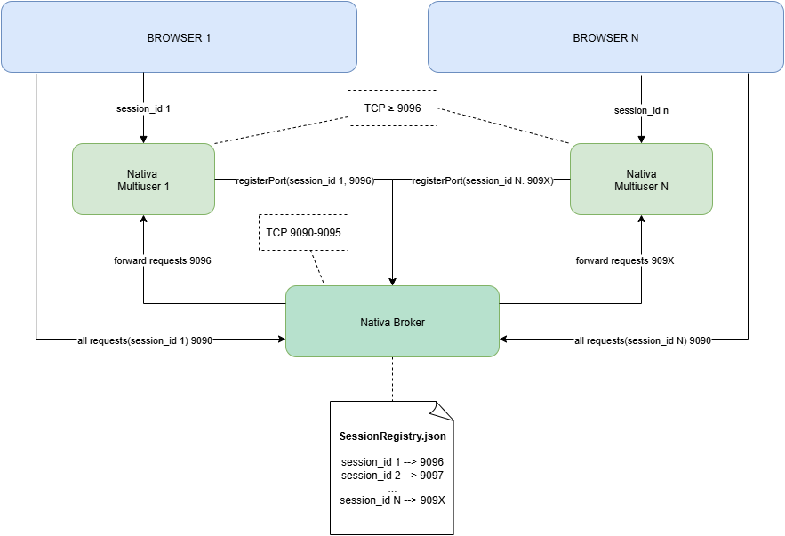

## Traçabilitat

### Traçabilitat del procés d’Instal·lació

Log de l’instal·lador.

#### Ubicació fitxer de log

El fitxer log amb les traces del procés d’instal·lació es genera en una ubicació diferent en funció de si el procés s’ha completat correctament o no.

**Instal·lació correcta**

En aquest cas, el log el podrem trobar dins del directori .install4j de la carpeta arrel de l’aplicació.

**Instal·lació amb errors**

En aquest cas, com que no es completa la instal·lació, no es crearà la carpeta arrel de l’aplicació. Per tant, el fitxer amb les traces del procés d’instal·lació s’ubicarà en la carpeta temporal de l’usuari que ha executat la instal·lació. El nom complet del fitxer pot variar en funció de l’execució, però sempre anirà precedit pel prefix ***ij4_log_ANSm***.

C:\Users\NOM_USUARI\AppData\Local\Temp\**i4j_log_ANSm_7188676932458092156.log**

#### Instal·lació correcta

A grans trets, una instal·lació correcta, a nivell de traçabilitat és aquella que presenta absència de traces amb l’etiqueta [ERROR].

### Traçabilitat de l’execució del Broker

Aquesta secció descriu on es desa la traçabilitat i mostra, amb exemples reals de logs, el comportament del **Broker** durant l’arrencada, el registre de la Nativa i l’execució d’una operació de signatura correcta.

#### Ubicació fitxer de log

El **Broker** desa totes les traces d’execució en un fitxer de registre anomenat **Broker.log**.

Aquest fitxer es troba dins la carpeta **log**, subdirectori de la carpeta d’instal·lació de la Nativa Multiusuari.

**Ruta completa**:

C:\Program Files\AOC\Signador\log\**Broker.log**

#### Inici correcte

A continuació podem veure les diferents fases d’arrencada del component.

**El port d’arrencada i la càrrega de configuració i traçabilitat:**

```text
2025-09-22 16:34:44 INFO LoggingConfig : [startupConfigLog4j] log4j loaded from filesystem: C:\Program Files\AOC\Signador\conf\log4j2-Broker.xml
2025-09-22 16:34:44 DEBUG NetworkUtils : El port 9090 està disponible
```

**Inicialització del logging i del servidor d’aplicacions *Jetty*:**

```text
2025-09-22 16:34:44 INFO LoggingConfig : 2025-09-22 16:34:44.457:INFO::main: Logging initialized @1309ms
2025-09-22 16:34:45 INFO LoggingConfig : 2025-09-22 16:34:45.366:INFO:oejs.Server:main: jetty-9.2.10.v20150310
2025-09-22 16:34:45 INFO LoggingConfig : 2025-09-22 16:34:45.663:INFO:oejsh.ContextHandler:main: Started o.e.j.s.ServletContextHandler@4462b9b{/,null,AVAILABLE}
2025-09-22 16:34:45 INFO LoggingConfig : 2025-09-22 16:34:45.679:INFO:oejs.ServerConnector:main: Started ServerConnector@20744346{SSL-http/1.1}{0.0.0.0:9090}
2025-09-22 16:34:45 INFO LoggingConfig : 2025-09-22 16:34:45.680:INFO:oejs.Server:main: Started @2532ms
2025-09-22 16:34:45 INFO BrokerServer : Server arrencat correctament.
```

#### Registre de la Nativa

A continuació es mostren les traces del Broker relatives al registre de la Nativa.

```text
2025-09-23 09:32:31 INFO SessionController : checkSession() - Sessió no trobada: pHnNTwOcke-Gvz1uwrBuQxo7Axi0OtIS4pXvWpKu0TE
2025-09-23 09:32:33 INFO SessionController : checkSession() - Sessió no trobada: pHnNTwOcke-Gvz1uwrBuQxo7Axi0OtIS4pXvWpKu0TE
2025-09-23 09:32:34 INFO SessionController : registerPortSession() - Parella sessió-port registrada correctament al registre de sessions. sessionId[pHnNTwOcke-Gvz1uwrBuQxo7Axi0OtIS4pXvWpKu0TE] - port[9096]
2025-09-23 09:32:35 INFO SessionController : checkSession() - Sessió trobada: pHnNTwOcke-Gvz1uwrBuQxo7Axi0OtIS4pXvWpKu0TE
```

En fer clic al botó “**Iniciar sessió**” al navegador, s’executa el protocol personalitzat i s’executa la Nativa. Mentrestant, la plantilla **JS** resta a l’espera que la Nativa s’inicialitzi i s’enregistri al Broker la parella **identificador de sessió/port** de l’aplicació.

Tal i com es pot veure a les traces, aquesta espera es materialitza en un **sondeig recurrent** al mètode *checkSession()* del Broker. El JS fa crides iteratives fins a assolir un temps d’espera màxim o bé fins que rep la resposta “**Sessió trobada**”. En aquest punt, la plantilla interpreta que la Nativa ja és operativa i pot continuar amb el flux normal d’execució.

En les traces també es veu la crida que fa la Nativa al Broker per **enregistrar la sessió** durant la seva inicialització. Un cop enregistrada la parella *sessionId/port*, la següent crida *checkSession()* del navegador ja resulta correcta.

#### Operació de signatura correcta

En aquest apartat es documenta el flux complet d’una operació de signatura correcta. En primer lloc, es mostren les traces d’obtenció dels certificats per signar, i tot seguit, la petició de signatura del document.

**Obtenció de certificat per signar**

```text
2025-09-23 11:25:43 INFO BrokerRequestAdapter: adaptAndForward() - Sessió [WZXFT9_PDg1637m9mTOL8gxEO32U7X_mTbYG-_1h3mo] trobada al registre de sessions del Broker.
2025-09-23 11:25:43 INFO BrokerRequestAdapter: adaptAndForward() - Sessió [WZXFT9_PDg1637m9mTOL8gxEO32U7X_mTbYG-_1h3mo] trobada al registre de sessions del Broker.
2025-09-23 11:25:43 INFO BrokerRequestAdapter: adaptAndForward() - El port associat a la sessió és: 9096
2025-09-23 11:25:43 INFO BrokerRequestAdapter: adaptAndForward() - El port associat a la sessió és: 9096
2025-09-23 11:25:43 INFO BrokerRequestAdapter: adaptAndForward() - Adaptant petició [OPTIONS] a URL: https://nativa.aoclocal.cat:9096/version
2025-09-23 11:25:43 INFO BrokerRequestAdapter: adaptAndForward() - Adaptant petició [OPTIONS] a URL: https://nativa.aoclocal.cat:9096/getCertificate
2025-09-23 11:25:43 INFO BrokerRequestAdapter: Enviant petició a la Nativa.
2025-09-23 11:25:43 INFO BrokerRequestAdapter: Enviant petició a la Nativa.
2025-09-23 11:25:44 INFO NativaRestClient : sendRequest() - Enviant petició OPTIONS a https://nativa.aoclocal.cat:9096/version amb capçalera: null
2025-09-23 11:25:44 INFO NativaRestClient : sendRequest() - Enviant petició OPTIONS a https://nativa.aoclocal.cat:9096/getCertificate amb capçalera: null
2025-09-23 11:25:44 INFO NativaRestClient : Resposta de https://nativa.aoclocal.cat:9096/version a la peticio [OPTIONS]: HTTP 200
2025-09-23 11:25:44 INFO NativaRestClient : Resposta de https://nativa.aoclocal.cat:9096/getCertificate a la peticio [OPTIONS]: HTTP 200
2025-09-23 11:25:44 INFO BrokerRequestAdapter: adaptAndForward() - Sessió [WZXFT9_PDg1637m9mTOL8gxEO32U7X_mTbYG-_1h3mo] trobada al registre de sessions del Broker.
2025-09-23 11:25:44 INFO BrokerRequestAdapter: adaptAndForward() - El port associat a la sessió és: 9096
2025-09-23 11:25:44 INFO BrokerRequestAdapter: adaptAndForward() - Adaptant petició [POST] a URL: https://nativa.aoclocal.cat:9096/getCertificate?firefoxVersion=&browser=
2025-09-23 11:25:44 INFO BrokerRequestAdapter: Enviant petició a la Nativa.
2025-09-23 11:25:44 INFO NativaRestClient : sendRequest() - Enviant petició POST a https://nativa.aoclocal.cat:9096/getCertificate?firefoxVersion=&browser= amb capçalera: {Origin=https://Signador-dev.aoc.cat, Content-Type=application/json;charset=utf-8}
2025-09-23 11:25:44 INFO NativaRestClient : Resposta de https://nativa.aoclocal.cat:9096/getCertificate?firefoxVersion=&browser= a la peticio [POST]: HTTP 200
```

En aquest fragment s’observa com el navegador realitza dues peticions al Broker: */version* i */getCertificate.*

  - /**version**: comprova la versió de la Nativa per determinar si és una versió compatible o no amb la versió del Broker.

  - /**getCertificate**: obté el llistat de certificats disponibles a l’equip per a que l’usuari en pugui seleccionar un per a la signatura.

En ambdós casos, prèviament s’envia una petició **OPTIONS** per a les validacions **CORS**. El Broker actua d’intermediari: localitza el port de la Nativa al seu registre de sessions, **reenviant** la petició i **retornant** la resposta a la pàgina web.

**Signatura**

```text
2025-09-23 11:25:51 INFO BrokerRequestAdapter: adaptAndForward() - Sessió [WZXFT9_PDg1637m9mTOL8gxEO32U7X_mTbYG-_1h3mo] trobada al registre de sessions del Broker.
2025-09-23 11:25:51 INFO BrokerRequestAdapter: adaptAndForward() - El port associat a la sessió és: 9096
2025-09-23 11:25:51 INFO BrokerRequestAdapter: adaptAndForward() - Adaptant petició [OPTIONS] a URL: https://nativa.aoclocal.cat:9096/signature
2025-09-23 11:25:51 INFO BrokerRequestAdapter: Enviant petició a la Nativa.
2025-09-23 11:25:51 INFO NativaRestClient : sendRequest() - Enviant petició OPTIONS a https://nativa.aoclocal.cat:9096/signature amb capçalera: null
2025-09-23 11:25:51 INFO NativaRestClient : Resposta de https://nativa.aoclocal.cat:9096/signature a la peticio [OPTIONS]: HTTP 200
2025-09-23 11:25:51 INFO BrokerRequestAdapter: adaptAndForward() - Sessió [WZXFT9_PDg1637m9mTOL8gxEO32U7X_mTbYG-_1h3mo] trobada al registre de sessions del Broker.
2025-09-23 11:25:51 INFO BrokerRequestAdapter: adaptAndForward() - El port associat a la sessió és: 9096
2025-09-23 11:25:51 INFO BrokerRequestAdapter: adaptAndForward() - Adaptant petició [POST] a URL: https://nativa.aoclocal.cat:9096/signature?firefoxVersion=&browser=&alias=U2lzdGVtYSBvIGFwbGljYWNp8yBkZSBwcm92YSBbT3JnYW5pdHphY2nzIGRlIHByb3ZhXSAgKFN1YkNBIFNFQ1RPUiBQVUJMSUMgUSAoRzMpIEEuMSBbQ09OU09SQ0kgQURNSU5JU1RSQUNJTyBPQkVSVEEgREUgQ0FUQUxVTllBXSkgLSBTTjogRjZBQTUzNCAtIENhZHVjYTogMjAvMDMvMjAyOA%3D%3D
2025-09-23 11:25:51 INFO BrokerRequestAdapter: Enviant petició a la Nativa.
2025-09-23 11:25:51 INFO NativaRestClient : sendRequest() - Enviant petició POST a https://nativa.aoclocal.cat:9096/signature?firefoxVersion=&browser=&alias=U2lzdGVtYSBvIGFwbGljYWNp8yBkZSBwcm92YSBbT3JnYW5pdHphY2nzIGRlIHByb3ZhXSAgKFN1YkNBIFNFQ1RPUiBQVUJMSUMgUSAoRzMpIEEuMSBbQ09OU09SQ0kgQURNSU5JU1RSQUNJTyBPQkVSVEEgREUgQ0FUQUxVTllBXSkgLSBTTjogRjZBQTUzNCAtIENhZHVjYTogMjAvMDMvMjAyOA%3D%3D amb capçalera: {Origin=https://Signador-dev.aoc.cat, Content-Type=application/json;charset=utf-8}
2025-09-23 11:25:52 INFO NativaRestClient : Resposta de https://nativa.aoclocal.cat:9096/signature?firefoxVersion=&browser=&alias=U2lzdGVtYSBvIGFwbGljYWNp8yBkZSBwcm92YSBbT3JnYW5pdHphY2nzIGRlIHByb3ZhXSAgKFN1YkNBIFNFQ1RPUiBQVUJMSUMgUSAoRzMpIEEuMSBbQ09OU09SQ0kgQURNSU5JU1RSQUNJTyBPQkVSVEEgREUgQ0FUQUxVTllBXSkgLSBTTjogRjZBQTUzNCAtIENhZHVjYTogMjAvMDMvMjAyOA%3D%3D a la peticio [POST]: HTTP 200
```

Aquestes traces segueixen el mateix patró: validació prèvia amb OPTIONS (CORS) i execució del POST de /signature, on s’indica l’àlies del certificat seleccionat. La resposta HTTP 200 confirma que el document s’ha signat correctament.

### Traçabilitat de l’execució de la Nativa

Aquesta secció mostra on es desa la traçabilitat i com es veu, des del costat de la **Nativa**, un **inici correcte**, el **registre** davant del Broker i una **operació de signatura correcta**.

#### Ubicació fitxer de log

La Nativa desa les traces en el fitxer següent:

C:\Program Files\AOC\Signador\log\**webappTemp.log**

#### Inici correcte

A continuació es mostren les principals traces de l’arrencada de la Nativa (càrrega de configuració, obtenció de port lliure, generació/instal·lació del certificat arrel i arrancada del servidor d’aplicacions Jetty):

```text
2025-09-23 13:17:13 INFO LoggingConfig : configLog4j() - log4j loaded from filesystem: C:\Program Files\AOC\Signador\conf\log4j2-nativa.xml
2025-09-23 13:17:13 INFO NativaServer : Mode d'execució de la nativa: multiuser
2025-09-23 13:17:13 INFO NativaServer : extractAndValidateSessionIdFromArgs() - Validant el sessionId: OS4_YUToeJylboki3UCAh9OxswTMOnDK1RyR0_wkBxE
2025-09-23 13:17:13 INFO NativaServer : extractAndValidateSessionIdFromArgs() - sessionId vàlid.
2025-09-23 13:17:14 INFO ProcessUtils : findSignadorProcess() - Sha trobat un procès Signador.exe amb el PID: 18436
2025-09-23 13:17:14 INFO NetworkUtils : findPortFrom() - Port disponible trobat: 9096
...
2025-09-23 13:17:16 INFO NativaServer : Multiusuari: NO es genera ni s’instal·la el certificat arrel (root.crt); s’usarà el certificat existent.
2025-09-23 13:17:16 INFO LoggingConfig : 2025-09-23 13:17:16.268:INFO::main: Logging initialized @3405ms
2025-09-23 13:17:16 INFO LoggingConfig : 2025-09-23 13:17:16.318:INFO:oejs.Server:main: jetty-9.2.10.v20150310
2025-09-23 13:17:16 INFO LoggingConfig : 2025-09-23 13:17:16.589:INFO:oejsh.ContextHandler:main: Started o.e.j.s.ServletContextHandler@383790cf{/,null,AVAILABLE}
2025-09-23 13:17:16 INFO LoggingConfig : 2025-09-23 13:17:16.606:INFO:oejs.ServerConnector:main: Started ServerConnector@3a627c80{SSL-http/1.1}{0.0.0.0:9096}
2025-09-23 13:17:16 INFO LoggingConfig : 2025-09-23 13:17:16.607:INFO:oejs.Server:main: Started @3744ms
2025-09-23 13:17:16 INFO NativaServer : Server arrancat correctament.
```

#### Registre de la Nativa

El registre és el pas en què la Nativa comunica al Broker el port on escoltarà per a aquella sessió.

Les traces en qüestió que podem observar a la Nativa són:

```text
2025-09-23 13:17:14 INFO NetworkUtils : findListeningPort() - El host nativa.aoclocal.cat (Broker) està escoltant al port 9090
2025-09-23 13:17:15 INFO NativaRestClient : sendRequest() - Enviant petició POST a https://nativa.aoclocal.cat:9090/sessions/registerPort amb capçalera: {Accept=application/json;charset=utf-8, Content-Type=application/json;charset=utf-8}
2025-09-23 13:17:16 INFO NativaRestClient : sendRequest() - Resposta de https://nativa.aoclocal.cat:9090/sessions/registerPort a la peticio [POST]: HTTP 200
2025-09-23 13:17:16 INFO SessionRegistrationService: registerSession() - Sessió registrada correctament al Broker: HTTP 200
```

#### Operació de signatura correcta

A continuació es mostra la traçabilitat principal de la fase d’obtenció de certificats i de la signatura.

**Obtenció de certificats**

```text
2025-09-23 14:50:52 INFO LoggingConfig : [AplicacioSignatura] Ignored parameter pdf_reason:=
2025-09-23 14:50:52 INFO LoggingConfig : [AplicacioSignatura] Ignored parameter pdf_location:=
2025-09-23 14:50:52 INFO LoggingConfig : [GlobalProperties] Error loading properties from: https://Signador-dev.aoc.cat/Signador/props. Just using the default ones.
2025-09-23 14:50:52 INFO LoggingConfig : [GlobalProperties] RELOADABLE_ISSUERS := CN=AC RAIZ DNIE 2, OU=DNIE, O=DIRECCION GENERAL DE LA POLICIA, C=ES;CN=AC RAIZ DNIE, OU=DNIE, O=DIRECCION GENERAL DE LA POLICIA, C=ES
2025-09-23 14:50:52 INFO LoggingConfig : [OSName] Sistema operatiu: Windows 10
2025-09-23 14:50:52 INFO LoggingConfig : Current OS: Windows 10
2025-09-23 14:50:52 INFO LoggingConfig : [AppletSignatura] -------------------------------------
2025-09-23 14:50:52 INFO LoggingConfig : [AppletSignatura] APPLET PROPERTIES
2025-09-23 14:50:52 INFO LoggingConfig : [AppletSignatura] -------------------------------------
2025-09-23 14:50:52 INFO LoggingConfig : [AppletSignatura] Param: keystore_type Value: 1
2025-09-23 14:50:52 INFO LoggingConfig : [AppletSignatura] Param: appletParams Value: org.catcert.params.AppletParams@5959c7f
2025-09-23 14:50:52 INFO LoggingConfig : [AppletSignatura] Param: document_to_sign Value: gYbYj9w6DofPvCfwqKKwXitsErA=
2025-09-23 14:50:52 INFO LoggingConfig : [AppletSignatura] Param: local_file Value: false
2025-09-23 14:50:52 INFO LoggingConfig : [AppletSignatura] Param: local_file_result_message Value: true
2025-09-23 14:50:52 INFO LoggingConfig : [AppletSignatura] Param: doc_type Value: 3
2025-09-23 14:50:52 INFO LoggingConfig : [AppletSignatura] Param: output_mode Value: 2
2025-09-23 14:50:52 INFO LoggingConfig : [AppletSignatura] Param: output_filename Value: null
2025-09-23 14:50:52 INFO LoggingConfig : [AppletSignatura] Param: pkcs11_files Value: null
2025-09-23 14:50:52 INFO LoggingConfig : [AppletSignatura] Param: pkcs12_file Value:
2025-09-23 14:50:52 INFO LoggingConfig : [AppletSignatura] Param: jks_file Value:
2025-09-23 14:50:52 INFO LoggingConfig : [AppletSignatura] Param: n_enveloping Value: false
2025-09-23 14:50:52 INFO LoggingConfig : [AppletSignatura] Param: n_detached Value: false
2025-09-23 14:50:52 INFO LoggingConfig : [AppletSignatura] Param: allowed_CAs Value: null
2025-09-23 14:50:52 INFO LoggingConfig : [AppletSignatura] Param: allowed_OIDs Value: null
2025-09-23 14:50:52 INFO LoggingConfig : [AppletSignatura] Param: selected_alias Value:
2025-09-23 14:50:52 INFO LoggingConfig : [AppletSignatura] Param: selected_CN Value: null
2025-09-23 14:50:52 INFO LoggingConfig : [AppletSignatura] Param: subject_Text Value: null
2025-09-23 14:50:52 INFO LoggingConfig : [AppletSignatura] Param: required_nif Value: null
2025-09-23 14:50:52 INFO LoggingConfig : [AppletSignatura] Param: appletBackground Value: java.awt.Color[r=255,g=255,b=255]
2025-09-23 14:50:52 INFO LoggingConfig : [AppletSignatura] Param: appletLogo Value: null
2025-09-23 14:50:52 INFO LoggingConfig : [AppletSignatura] Param: language Value: ca
2025-09-23 14:50:52 INFO LoggingConfig : [AppletSignatura] Param: keep_console Value: null
2025-09-23 14:50:52 INFO LoggingConfig : [AppletSignatura] Param: pdf_dinamic_signature_image Value: false
2025-09-23 14:50:52 INFO LoggingConfig : [AppletSignatura] Param: abort_pdf_sign_operation Value: false
2025-09-23 14:50:52 INFO LoggingConfig : [AppletSignatura] Param: sign_first_sign_fields Value: false
2025-09-23 14:50:52 INFO LoggingConfig : [AppletSignatura] Param: mode Value: null
2025-09-23 14:50:52 INFO LoggingConfig : [AppletSignatura] Param: signingCert Value: null
2025-09-23 14:50:52 INFO LoggingConfig : [AppletSignatura] Param: browser Value: FIREFOX
2025-09-23 14:50:52 INFO LoggingConfig : [AppletSignatura] Param: pathFilesLocal Value: null
2025-09-23 14:50:52 INFO LoggingConfig : [AppletSignatura] Param: keyUsage Value: null
2025-09-23 14:50:52 INFO LoggingConfig : [AppletSignatura] Param: doc_name Value: doc1
2025-09-23 14:50:52 INFO LoggingConfig : [AppletSignatura] Param: signados Value: 0
2025-09-23 14:50:52 INFO LoggingConfig : [AppletSignatura] Param: token Value: 812e6937-a5b4-4c6c-a326-42bfdca4ab7b
2025-09-23 14:50:52 INFO LoggingConfig : [AppletSignatura] Param: restService Value: https://Signador-dev.aoc.cat/Signador/responseSignature
2025-09-23 14:50:52 INFO LoggingConfig : [AppletSignatura] Param: hashOperacio Value: 5GLLHoNzgMyHNTp+rPy0sm+rKg0=
2025-09-23 14:50:52 INFO LoggingConfig : [AppletSignatura] Param: pdfSignatureParams Value: org.catcert.params.PdfSignatureParams@2c5aa029
2025-09-23 14:50:52 INFO LoggingConfig : [AppletSignatura] Param: signatureType Value: Type: XML Form: ades_bes Mode: detached Over: hash
2025-09-23 14:50:52 INFO LoggingConfig : [AppletSignatura] Param: required_nif Value: null
2025-09-23 14:50:52 INFO LoggingConfig : [AppletSignatura] Param: psis_validation Value: false
2025-09-23 14:50:52 INFO LoggingConfig : [AppletSignatura] Param: cmsts_tsa_url Value: https://psis.aoc.cat/psis/catcert/tsp
2025-09-23 14:50:52 INFO LoggingConfig : [AppletSignatura] Param: proxy_settings Value: null
2025-09-23 14:50:52 INFO LoggingConfig : [AppletSignatura] Param: commitment_identifier Value: []
2025-09-23 14:50:52 INFO LoggingConfig : [AppletSignatura] Param: commitment_description Value: []
2025-09-23 14:50:52 INFO LoggingConfig : [AppletSignatura] Param: signer_role Value: null
2025-09-23 14:50:52 INFO LoggingConfig : [AppletSignatura] Param: signature_policy Value: null
2025-09-23 14:50:52 INFO LoggingConfig : [AppletSignatura] Param: signature_policy_hash Value: null
2025-09-23 14:50:52 INFO LoggingConfig : [AppletSignatura] Param: timeStamp_CMS_signature Value: false
2025-09-23 14:50:52 INFO LoggingConfig : [AppletSignatura] Param: includeXMLTimestamp Value: true
2025-09-23 14:50:52 INFO LoggingConfig : [AppletSignatura] Param: xmlts_tsa_url Value: https://psis.aoc.cat/psis/catcert/dss
2025-09-23 14:50:52 INFO LoggingConfig : [AppletSignatura] Param: uris_to_be_signed Value: []
2025-09-23 14:50:52 INFO LoggingConfig : [AppletSignatura] Param: protectKeyInfo Value: false
2025-09-23 14:50:52 INFO LoggingConfig : [AppletSignatura] Param: canonicalizationWithComments Value: false
2025-09-23 14:50:52 INFO LoggingConfig : [AppletSignatura] Param: commitment_object_reference Value: []
2025-09-23 14:50:52 INFO LoggingConfig : [AppletSignatura] Param: signature_policy_qualifier Value: null
2025-09-23 14:50:52 INFO LoggingConfig : [AppletSignatura] Param: hash_algorithm Value: SHA-1
2025-09-23 14:50:52 INFO LoggingConfig : [AppletSignatura] Param: signature_policy_hash_algorithm Value: SHA-256
2025-09-23 14:50:52 INFO LoggingConfig : [AppletSignatura] PDFParam: signatureVisible Value: true
2025-09-23 14:50:52 INFO LoggingConfig : [AppletSignatura] PDFParam: reservedSpace Value: null
2025-09-23 14:50:52 INFO LoggingConfig : [AppletSignatura] PDFParam: signatureField Value: null
2025-09-23 14:50:52 INFO LoggingConfig : [AppletSignatura] PDFParam: certificationLevel Value: 0
2025-09-23 14:50:52 INFO LoggingConfig : [AppletSignatura] PDFParam: reason Value: null
2025-09-23 14:50:52 INFO LoggingConfig : [AppletSignatura] PDFParam: location Value: null
2025-09-23 14:50:52 INFO LoggingConfig : [AppletSignatura] PDFParam: signatureImage Value: null
2025-09-23 14:50:52 INFO LoggingConfig : [AppletSignatura] PDFParam: signatureRectangle Value: null
2025-09-23 14:50:52 INFO LoggingConfig : [AppletSignatura] PDFParam: signatureRectangleString Value: null
2025-09-23 14:50:52 INFO LoggingConfig : [AppletSignatura] PDFParam: signaturePageNumber Value: 1
2025-09-23 14:50:52 INFO LoggingConfig : [AppletSignatura] PDFParam: signatureRotation Value: 0
2025-09-23 14:50:52 INFO LoggingConfig : [AppletSignatura] PDFParam: showGreenTick Value: true
2025-09-23 14:50:52 INFO LoggingConfig : [AppletSignatura] PDFParam: signatureRenderingMode Value: 0
2025-09-23 14:50:52 INFO LoggingConfig : [AppletSignatura] -------------------------------------
2025-09-23 14:50:52 INFO LoggingConfig : [AppletSignatura] PROPERTIES SO
2025-09-23 14:50:52 INFO LoggingConfig : [AppletSignatura] -------------------------------------
2025-09-23 14:50:52 INFO LoggingConfig : [AppletSignatura] APPLET JNLP VERSIO 3.0.1
2025-09-23 14:50:52 INFO LoggingConfig : [AppletSignatura] JAVA VERSION: 1.8.0_302
2025-09-23 14:50:52 INFO LoggingConfig : [AppletSignatura] OS NAME: Windows 10
2025-09-23 14:50:52 INFO LoggingConfig : [AppletSignatura] OS ARCH: amd64
2025-09-23 14:50:52 INFO LoggingConfig : [AppletSignatura] JAVA LIBRARY PATH: lib
2025-09-23 14:50:52 INFO LoggingConfig : [AppletSignatura] BROWSER: FIREFOX
2025-09-23 14:50:52 INFO LoggingConfig : [AppletSignatura] FIREFOX_VERSION: V75
2025-09-23 14:50:52 INFO LoggingConfig : [AddSunMSCAPIProvider] sunMSCAPI defacto, evitem carregar la nostra dll.
2025-09-23 14:50:52 INFO LoggingConfig : [MSKeyStore] Anem a eliminar els alies duplicats
2025-09-23 14:50:52 INFO LoggingConfig : [MSKeyStore] Iniciant operació d'eliminació de claus
2025-09-23 14:50:52 INFO LoggingConfig : [MSKeyStore] Comprovem si la clau iArxiu preproduccio ha de ser eliminada
2025-09-23 14:50:52 INFO LoggingConfig : [MSKeyStore] Comprovem si la clau Sistema o aplicació de prova ha de ser eliminada
2025-09-23 14:50:52 INFO CertificateService : getCerts() - Nombre de certificats obtinguts per signar: 2
```

El bloc **[AppletSignatura]/[OSName]** reflecteix els paràmetres de configuració i l’entorn, que imprimeix el JavaScript que s’executa en el navegador; i la Nativa els recull perquè el component **LoggingConfig** redirigeix la sortida de consola cap al sistema de logs. En paral·lel, els missatges **[AddSunMSCAPIProvider]** i **[MSKeyStore]** indiquen que s’utilitzarà el proveïdor criptogràfic Sun’s Microsoft Crypto API i que es fa una neteja d’àlies al magatzem abans d’enumerar-los.

Finalment, la crida ***CertificateService.getCerts()*** retorna el certificats disponibles perquè l’usuari en pugui seleccionar un per a la signatura.

**Signatura**

```text
2025-09-23 14:51:43 INFO SignatureService : signature() - alias del certificat que s'utilitzarà per signar: Sistema o aplicació de prova [Organització de prova] (SubCA SECTOR PUBLIC Q (G3) A.1 [CONSORCI ADMINISTRACIO OBERTA DE CATALUNYA]) - SN: F6AA534 - Caduca: 20/03/2028
2025-09-23 14:51:52 INFO LoggingConfig : [AplicacioSignatura] Ignored parameter pdf_reason:=
2025-09-23 14:51:52 INFO LoggingConfig : [AplicacioSignatura] Ignored parameter pdf_location:=
2025-09-23 14:51:53 INFO LoggingConfig : [GlobalProperties] Error loading properties from: https://Signador-dev.aoc.cat/Signador/props. Just using the default ones.
2025-09-23 14:51:53 INFO LoggingConfig : [GlobalProperties] RELOADABLE_ISSUERS := CN=AC RAIZ DNIE 2, OU=DNIE, O=DIRECCION GENERAL DE LA POLICIA, C=ES;CN=AC RAIZ DNIE, OU=DNIE, O=DIRECCION GENERAL DE LA POLICIA, C=ES
2025-09-23 14:51:53 INFO LoggingConfig : [OSName] Sistema operatiu: Windows 10
2025-09-23 14:51:53 INFO LoggingConfig : Current OS: Windows 10
2025-09-23 14:51:53 INFO LoggingConfig : [AppletSignatura] -------------------------------------
2025-09-23 14:51:53 INFO LoggingConfig : [AppletSignatura] APPLET PROPERTIES
2025-09-23 14:51:53 INFO LoggingConfig : [AppletSignatura] -------------------------------------
2025-09-23 14:51:53 INFO LoggingConfig : [AppletSignatura] Param: keystore_type Value: 1
2025-09-23 14:51:53 INFO LoggingConfig : [AppletSignatura] Param: appletParams Value: org.catcert.params.AppletParams@1128acfe
2025-09-23 14:51:53 INFO LoggingConfig : [AppletSignatura] Param: document_to_sign Value: gYbYj9w6DofPvCfwqKKwXitsErA=
2025-09-23 14:51:53 INFO LoggingConfig : [AppletSignatura] Param: local_file Value: false
2025-09-23 14:51:53 INFO LoggingConfig : [AppletSignatura] Param: local_file_result_message Value: true
2025-09-23 14:51:53 INFO LoggingConfig : [AppletSignatura] Param: doc_type Value: 3
2025-09-23 14:51:53 INFO LoggingConfig : [AppletSignatura] Param: output_mode Value: 2
2025-09-23 14:51:53 INFO LoggingConfig : [AppletSignatura] Param: output_filename Value: null
2025-09-23 14:51:53 INFO LoggingConfig : [AppletSignatura] Param: pkcs11_files Value: null
2025-09-23 14:51:53 INFO LoggingConfig : [AppletSignatura] Param: pkcs12_file Value:
2025-09-23 14:51:53 INFO LoggingConfig : [AppletSignatura] Param: jks_file Value:
2025-09-23 14:51:53 INFO LoggingConfig : [AppletSignatura] Param: n_enveloping Value: false
2025-09-23 14:51:53 INFO LoggingConfig : [AppletSignatura] Param: n_detached Value: false
2025-09-23 14:51:53 INFO LoggingConfig : [AppletSignatura] Param: allowed_CAs Value: null
2025-09-23 14:51:53 INFO LoggingConfig : [AppletSignatura] Param: allowed_OIDs Value: null
2025-09-23 14:51:53 INFO LoggingConfig : [AppletSignatura] Param: selected_alias Value:
2025-09-23 14:51:53 INFO LoggingConfig : [AppletSignatura] Param: selected_CN Value: null
2025-09-23 14:51:53 INFO LoggingConfig : [AppletSignatura] Param: subject_Text Value: null
2025-09-23 14:51:53 INFO LoggingConfig : [AppletSignatura] Param: required_nif Value: null
2025-09-23 14:51:53 INFO LoggingConfig : [AppletSignatura] Param: appletBackground Value: java.awt.Color[r=255,g=255,b=255]
2025-09-23 14:51:53 INFO LoggingConfig : [AppletSignatura] Param: appletLogo Value: null
2025-09-23 14:51:53 INFO LoggingConfig : [AppletSignatura] Param: language Value: ca
2025-09-23 14:51:53 INFO LoggingConfig : [AppletSignatura] Param: keep_console Value: null
2025-09-23 14:51:53 INFO LoggingConfig : [AppletSignatura] Param: pdf_dinamic_signature_image Value: false
2025-09-23 14:51:53 INFO LoggingConfig : [AppletSignatura] Param: abort_pdf_sign_operation Value: false
2025-09-23 14:51:53 INFO LoggingConfig : [AppletSignatura] Param: sign_first_sign_fields Value: false
2025-09-23 14:51:53 INFO LoggingConfig : [AppletSignatura] Param: mode Value: null
2025-09-23 14:51:53 INFO LoggingConfig : [AppletSignatura] Param: signingCert Value: null
2025-09-23 14:51:53 INFO LoggingConfig : [AppletSignatura] Param: browser Value: FIREFOX
2025-09-23 14:51:53 INFO LoggingConfig : [AppletSignatura] Param: pathFilesLocal Value: null
2025-09-23 14:51:53 INFO LoggingConfig : [AppletSignatura] Param: keyUsage Value: null
2025-09-23 14:51:53 INFO LoggingConfig : [AppletSignatura] Param: doc_name Value: doc1
2025-09-23 14:51:53 INFO LoggingConfig : [AppletSignatura] Param: signados Value: 0
2025-09-23 14:51:53 INFO LoggingConfig : [AppletSignatura] Param: token Value: 812e6937-a5b4-4c6c-a326-42bfdca4ab7b
2025-09-23 14:51:53 INFO LoggingConfig : [AppletSignatura] Param: restService Value: https://Signador-dev.aoc.cat/Signador/responseSignature
2025-09-23 14:51:53 INFO LoggingConfig : [AppletSignatura] Param: hashOperacio Value: 5GLLHoNzgMyHNTp+rPy0sm+rKg0=
2025-09-23 14:51:53 INFO LoggingConfig : [AppletSignatura] Param: pdfSignatureParams Value: org.catcert.params.PdfSignatureParams@4e3bc05
2025-09-23 14:51:53 INFO LoggingConfig : [AppletSignatura] Param: signatureType Value: Type: XML Form: ades_bes Mode: detached Over: hash
2025-09-23 14:51:53 INFO LoggingConfig : [AppletSignatura] Param: required_nif Value: null
2025-09-23 14:51:53 INFO LoggingConfig : [AppletSignatura] Param: psis_validation Value: false
2025-09-23 14:51:53 INFO LoggingConfig : [AppletSignatura] Param: cmsts_tsa_url Value: https://psis.aoc.cat/psis/catcert/tsp
2025-09-23 14:51:53 INFO LoggingConfig : [AppletSignatura] Param: proxy_settings Value: null
2025-09-23 14:51:53 INFO LoggingConfig : [AppletSignatura] Param: commitment_identifier Value: []
2025-09-23 14:51:53 INFO LoggingConfig : [AppletSignatura] Param: commitment_description Value: []
2025-09-23 14:51:53 INFO LoggingConfig : [AppletSignatura] Param: signer_role Value: null
2025-09-23 14:51:53 INFO LoggingConfig : [AppletSignatura] Param: signature_policy Value: null
2025-09-23 14:51:53 INFO LoggingConfig : [AppletSignatura] Param: signature_policy_hash Value: null
2025-09-23 14:51:53 INFO LoggingConfig : [AppletSignatura] Param: timeStamp_CMS_signature Value: false
2025-09-23 14:51:53 INFO LoggingConfig : [AppletSignatura] Param: includeXMLTimestamp Value: true
2025-09-23 14:51:53 INFO LoggingConfig : [AppletSignatura] Param: xmlts_tsa_url Value: https://psis.aoc.cat/psis/catcert/dss
2025-09-23 14:51:53 INFO LoggingConfig : [AppletSignatura] Param: uris_to_be_signed Value: []
2025-09-23 14:51:53 INFO LoggingConfig : [AppletSignatura] Param: protectKeyInfo Value: false
2025-09-23 14:51:53 INFO LoggingConfig : [AppletSignatura] Param: canonicalizationWithComments Value: false
2025-09-23 14:51:53 INFO LoggingConfig : [AppletSignatura] Param: commitment_object_reference Value: []
2025-09-23 14:51:53 INFO LoggingConfig : [AppletSignatura] Param: signature_policy_qualifier Value: null
2025-09-23 14:51:53 INFO LoggingConfig : [AppletSignatura] Param: hash_algorithm Value: SHA-1
2025-09-23 14:51:53 INFO LoggingConfig : [AppletSignatura] Param: signature_policy_hash_algorithm Value: SHA-256
2025-09-23 14:51:53 INFO LoggingConfig : [AppletSignatura] PDFParam: signatureVisible Value: true
2025-09-23 14:51:53 INFO LoggingConfig : [AppletSignatura] PDFParam: reservedSpace Value: null
2025-09-23 14:51:53 INFO LoggingConfig : [AppletSignatura] PDFParam: signatureField Value: null
2025-09-23 14:51:53 INFO LoggingConfig : [AppletSignatura] PDFParam: certificationLevel Value: 0
2025-09-23 14:51:53 INFO LoggingConfig : [AppletSignatura] PDFParam: reason Value: null
2025-09-23 14:51:53 INFO LoggingConfig : [AppletSignatura] PDFParam: location Value: null
2025-09-23 14:51:53 INFO LoggingConfig : [AppletSignatura] PDFParam: signatureImage Value: null
2025-09-23 14:51:53 INFO LoggingConfig : [AppletSignatura] PDFParam: signatureRectangle Value: null
2025-09-23 14:51:53 INFO LoggingConfig : [AppletSignatura] PDFParam: signatureRectangleString Value: null
2025-09-23 14:51:53 INFO LoggingConfig : [AppletSignatura] PDFParam: signaturePageNumber Value: 1
2025-09-23 14:51:53 INFO LoggingConfig : [AppletSignatura] PDFParam: signatureRotation Value: 0
2025-09-23 14:51:53 INFO LoggingConfig : [AppletSignatura] PDFParam: showGreenTick Value: true
2025-09-23 14:51:53 INFO LoggingConfig : [AppletSignatura] PDFParam: signatureRenderingMode Value: 0
2025-09-23 14:51:53 INFO LoggingConfig : [AppletSignatura] -------------------------------------
2025-09-23 14:51:53 INFO LoggingConfig : [AppletSignatura] PROPERTIES SO
2025-09-23 14:51:53 INFO LoggingConfig : [AppletSignatura] -------------------------------------
2025-09-23 14:51:53 INFO LoggingConfig : [AppletSignatura] APPLET JNLP VERSIO 3.0.1
2025-09-23 14:51:53 INFO LoggingConfig : [AppletSignatura] JAVA VERSION: 1.8.0_302
2025-09-23 14:51:54 INFO LoggingConfig : [AppletSignatura] OS NAME: Windows 10
2025-09-23 14:51:54 INFO LoggingConfig : [AppletSignatura] OS ARCH: amd64
2025-09-23 14:51:54 INFO LoggingConfig : [AppletSignatura] JAVA LIBRARY PATH: lib
2025-09-23 14:51:54 INFO LoggingConfig : [AppletSignatura] BROWSER: FIREFOX
2025-09-23 14:51:54 INFO LoggingConfig : [AppletSignatura] FIREFOX_VERSION: V75
2025-09-23 14:51:54 INFO LoggingConfig : [AddSunMSCAPIProvider] sunMSCAPI defacto, evitem carregar la nostra dll.
2025-09-23 14:51:54 INFO LoggingConfig : [MSKeyStore] Anem a eliminar els alies duplicats
2025-09-23 14:51:54 INFO LoggingConfig : [MSKeyStore] Iniciant operació d'eliminació de claus
2025-09-23 14:51:54 INFO LoggingConfig : [MSKeyStore] Comprovem si la clau iArxiu preproduccio ha de ser eliminada
2025-09-23 14:51:54 INFO LoggingConfig : [MSKeyStore] Comprovem si la clau Sistema o aplicació de prova ha de ser eliminada
2025-09-23 14:51:58 INFO LoggingConfig : [AddSunMSCAPIProvider] sunMSCAPI defacto, evitem carregar la nostra dll.
2025-09-23 14:51:58 INFO LoggingConfig : [MSKeyStore] Anem a eliminar els alies duplicats
2025-09-23 14:51:58 INFO LoggingConfig : [MSKeyStore] Iniciant operació d'eliminació de claus
2025-09-23 14:51:58 INFO LoggingConfig : [MSKeyStore] Comprovem si la clau iArxiu preproduccio ha de ser eliminada
2025-09-23 14:51:58 INFO LoggingConfig : [MSKeyStore] Comprovem si la clau Sistema o aplicació de prova ha de ser eliminada
2025-09-23 14:51:58 INFO LoggingConfig : [AddSunMSCAPIProvider] sunMSCAPI defacto, evitem carregar la nostra dll.
2025-09-23 14:51:58 INFO LoggingConfig : [MSKeyStore] Anem a eliminar els alies duplicats
2025-09-23 14:51:58 INFO LoggingConfig : [MSKeyStore] Iniciant operació d'eliminació de claus
2025-09-23 14:51:58 INFO LoggingConfig : [MSKeyStore] Comprovem si la clau iArxiu preproduccio ha de ser eliminada
2025-09-23 14:51:58 INFO LoggingConfig : [MSKeyStore] Comprovem si la clau Sistema o aplicació de prova ha de ser eliminada
2025-09-23 14:51:58 INFO LoggingConfig : [AppletSignatura] (qtp261845810-24) Using keystore: Sun's Microsoft Crypto API provider
2025-09-23 14:51:58 INFO LoggingConfig : [AppletSignatura] (qtp261845810-24) Desem el certificat amb el que s'est� realitzant la signatura
2025-09-23 14:52:03 INFO LoggingConfig : [javascript] is called: onSignOK
2025-09-23 14:52:03 INFO LoggingConfig : [javascriptSignOK] is called
2025-09-23 14:52:04 INFO LoggingConfig : [javascript] is called: onMultiSignOK
2025-09-23 14:52:20 INFO SignatureService : signature() - La signatura del document s'ha realitzat correctament.
```

Durant la fase de signatura, ***SignatureService.signature()*** inicia el procés de signatura i deixa constància al log del certificat emprat (àlies, número de sèrie i caducitat). Tot seguit, els missatges **[AppletSignatura]** mostren els paràmetres que s’apliquen en l’operació de signatura.

Un cop finalitzada la operació de signatura, els callbacks **onSignOK** i **onMultiSignOK** notifiquen l’èxit d’aquesta al client web, i el servei tanca enregistrant el missatge “**La signatura del document s’ha realitzat correctament**”.

### Traçabilitat de l’execució de NativaCertificateManager

Aquesta secció descriu on es desa la traçabilitat i mostra, amb exemples reals de logs, el comportament del **NativaCertificateManager,** tant en una **generació/instal·lació** inicial del certificat arrel com en una **actualització** posterior.

#### Ubicació fitxer de log

El component desa les traces a:

C:\Program Files\AOC\Signador\log\**nativaCertificateUpdater.log**

#### Actualització de certificat correcta

**Generació/instal·lació inicial (en instal·lar l’aplicació o quan no existeix el certificat arrel)**

```text
2025-09-23 16:05:31 INFO LoggingConfig : [startupConfigLog4j] log4j loaded from filesystem: C:\Program Files\AOC\Signador\conf\log4j2-rootcert.xml
2025-09-23 16:05:31 INFO NativaRootCert : Inicialitzant Nativa RootCert
2025-09-23 16:05:31 WARN SelfCertificateService: No s'ha trobat certificat o keystore requerits
2025-09-23 16:05:32 INFO SelfCertificateService: createSelfCertificatChain() - El certificat s'ha generat correctament.
2025-09-23 16:05:32 INFO SelfCertificateService: Important certificat arrel al truststore del S.O i al keystore.jks
2025-09-23 16:05:32 INFO SelfCertificateService: Instal·lant certificat a Windows (nivell: MÀQUINA LOCAL)
2025-09-23 16:05:32 INFO SelfCertificateService: installCertificateToLocalMachineRoot() - Instal·lant certificat a LocalMachine\Root amb: certutil -addstore -f Root ".\certificate\root.crt"
2025-09-23 16:05:32 INFO SelfCertificateService: installCertificateToLocalMachineRoot() - Certificat instal·lat correctament a LocalMachine\Root.
2025-09-23 16:05:32 INFO SelfCertificateService: Important certificat arrel al truststore de cacerts.
2025-09-23 16:05:32 INFO SelfCertificateService: Alias 'nativa' no present dins de cacerts; no cal eliminar
2025-09-23 16:05:32 INFO SelfCertificateService: Certificat nativa importat correctament al truststore cacerts
2025-09-23 16:05:32 INFO SelfCertificateService: Canvis del truststore desats a fitxer: .\certificate\cacerts
2025-09-23 16:05:32 INFO NativaRootCert : Finalitzant Nativa RootCert
```

En aquest cas el component detecta que no hi ha certificat/truststores previs i genera una nova arrel, per després instal·lar-la al magatzem de Windows (LocalMachine\Root) i al truststore Java (cacerts).

**Actualització/Reinstal·lació (ja existeix un certificat arrel previ)**

```text
2025-09-23 15:49:27 INFO LoggingConfig : configLog4j() - log4j loaded from filesystem: C:\Program Files\AOC\Signador\conf\log4j2-rootcert.xml
2025-09-23 15:49:27 INFO NativaRootCert : Inicialitzant Nativa RootCert
2025-09-23 15:49:27 INFO SelfCertificateService: checkSelfCertificate() - Certificat .\certificate\root.crt i keystore .\certificate\keystore.jks trobats.
2025-09-23 15:49:27 INFO SelfCertificateService: createSelfCertificatChain() - Ja existeix un certificat arrel vàlid. No es necessari tornar-lo a generar.
2025-09-23 15:49:27 INFO SelfCertificateService: Important certificat arrel al truststore del S.O i al keystore.jks
2025-09-23 15:49:27 INFO SelfCertificateService: Instal·lant certificat a Windows (nivell: MÀQUINA LOCAL)
2025-09-23 15:49:27 INFO SelfCertificateService: installCertificateToLocalMachineRoot() - Instal·lant certificat a LocalMachine\Root amb: certutil -addstore -f Root ".\certificate\root.crt"
2025-09-23 15:49:28 INFO SelfCertificateService: installCertificateToLocalMachineRoot() - Certificat instal·lat correctament a LocalMachine\Root.
2025-09-23 15:49:28 INFO SelfCertificateService: Important certificat arrel al truststore de cacerts.
2025-09-23 15:49:28 INFO SelfCertificateService: Eliminat alias existent 'nativa' de .\certificate\cacerts
2025-09-23 15:49:28 INFO SelfCertificateService: Certificat nativa importat correctament al truststore cacerts
2025-09-23 15:49:28 INFO SelfCertificateService: Canvis del truststore desats a fitxer: .\certificate\cacerts
2025-09-23 15:49:28 INFO NativaRootCert : Finalitzant Nativa RootCert
```

### Registre de sessions actives

El **registre de sessions** és el mecanisme que el Broker utilitza per saber a quin port de la Nativa ha de redirigir cada petició del navegador. Quan la Nativa arrenca per a una sessió concreta, s’**enregistra** al Broker indicant el seu ***sessionId*** i el **port** d’escolta. A partir d’aquí, cada crida del navegador que passa pel Broker (p. ex. /version, /getCertificate, /signature) consulta aquest registre per verificar si la sessió existeix i per recuperar el port corresponent.

El fitxer es llegeix principalment durant les invocacions a ***checkSession()*** i en l’**encaminament de peticions cap a la Nativa** (**adaptAndForward()**). I s’actualitza en el moment en el que la Nativa enregistra una parella **sessionId/port**.

L’eliminació d’entrades es produeix quan la sessió expira segons la política d’inactivitat definida (una setmana): en aquest cas, el Broker, a partir d’una tasca planificada que s’executa cada hora (a partir de l’arrencada del Broker), retira la parella del registre i, des d’aquell moment, les consultes ***checkSession***() deixen de trobar-la de manera que el flux al navegador pot informar que cal reiniciar la sessió.

#### Ubicació/Format

El registre és un JSON persistit a disc a:

C:\Program Files\AOC\Signador\lib\**sessionRegistry.json**

**Format:**

```json
{
"9skdCejpnqd3_rIbGpBFldKVgo2aXgllusl4cfJTb2M" : {
"sessionId" : "9skdCejpnqd3_rIbGpBFldKVgo2aXgllusl4cfJTb2M",
"port" : 9096,
"timestamp" : 1758629908798
}
```
}

El contingut té forma de **diccionari** on cada clau és un *sessionId*, i el valor és un objecte amb tres camps: *sessionId*, *port* (el port on escolta la Nativa per a aquella sessió) i *timestamp* (marca temporal en mil·lisegons utilitzada per a control d’antiguitat/expiració).

## Apèndix

### Propietats dels executables

Aquesta secció descriu els fitxers i paràmetres de configuració dels tres components principals de **APP Nativa Signador Multiusuari**: **Signador**, **Broker** i **NativaCertificateUpdater**.

#### Component Signador

##### Propietats JVM (Signador.vmoptions)

El fitxer *Signador.vmoptions*, ubicat a la carpeta arrel de la instal·lació de l’aplicació, defineix les propietats que la màquina virtual Java (JVM) carrega en iniciar aquest component.

Les propietats definides són:

  - **-Duser.firefox.dir=C:\Program Files\Mozilla Firefox** Ruta d’instal·lació del navegador Firefox per a la seva integració amb l’aplicació.

  - **-Duser.home=C:\Users\...** Directori de treball de l’usuari actiu.

  - **-Duser.name=...** Nom de l’usuari actiu al sistema.

  - **-Djava.net.useSystemProxies=true** Habilita l’ús del proxy configurat al sistema operatiu.

  - **-Djavax.net.ssl.trustStore=...\cacerts** Magatzem de certificats de confiança utilitzat per validar connexions SSL/TLS.

*(En condicions normals no cal modificar aquest fitxer. Qualsevol canvi s’ha de fer sota la supervisió del proveïdor o de personal tècnic qualificat.)*

##### Configuració del log (log4j2-nativa.xml)

El fitxer ***log4j2-nativa.xml***, ubicat al directori **conf** de la carpeta arrel de la instal·lació del Signador, defineix la configuració del log d’aquest component.

Aquest fitxer determina com es generen les traces d’execució i els logs d’error, així com el nivell de detall i el destí dels registres, per facilitar les tasques de diagnòstic i suport tècnic.

##### Paràmetres d’execució (Signador.exe)

L’executable **Signador.exe** incorpora, de forma implícita, els següents paràmetres:

  - **-Djava.library.path=lib** Indica el directori on la màquina virtual Java ha de buscar les llibreries necessàries per l’execució del component.

  - **-Dlog4j.configurationFile=...\conf\log4j2-nativa.xml** Especifica el fitxer de configuració de Log4j2 que defineix com es gestionen les traces i els logs del component Signador.

Aquestes opcions estan incrustades a l’executable i no poden ser modificades manualment.

#### Component Broker

##### Propietats JVM (Broker.vmoptions)

El fitxer **Broker.vmoptions**, situat a la carpeta arrel de la instal·lació, defineix les propietats de la màquina virtual Java (JVM) que es carreguen en iniciar el component **Broker**.

Les propietats definides son:

  - **-Djava.net.useSystemProxies=true** Habilita l’ús del proxy configurat al sistema operatiu.

  - **-Djavax.net.ssl.trustStore=...\cacerts** Magatzem de certificats de confiança utilitzat per validar connexions SSL/TLS.

(En condicions normals no cal modificar aquest fitxer. Qualsevol canvi s’ha de fer sota la supervisió del proveïdor o de personal tècnic qualificat.)

##### Configuració del log (log4j2-broker.xml)

El fitxer **log4j2-broker.xml**, ubicat al directori **conf** de la carpeta arrel de la instal·lació del Signador, defineix la configuració del log d’aquest component.

Aquest fitxer determina com es generen les traces d’execució i els logs d’errors, així com el nivell de detall i el destí dels registres, per facilitar les tasques de diagnòstic i suport tècnic.

##### Paràmetres d’execució (Broker.exe)

L’executable **Broker.exe** incorpora, de manera integrada, els següents paràmetres:

  - **-Djava.library.path=lib** Indica el directori on la màquina virtual Java ha de buscar les llibreries necessàries per l’execució del component.

  - **-Dlog4j.configurationFile=...\conf\log4j2-broker.xml** Especifica el fitxer de configuració de Log4j2 que defineix com es gestionen les traces i els logs del component Broker.

Aquestes opcions estan incrustades a l’executable i no poden ser modificades manualment.

#### Component NativaCertificateUpdater

##### Propietats JVM (NativaCertificateUpdater.vmoptions)

El fitxer **NativaCertificateUpdater.vmoptions**, ubicat a la carpeta arrel de la instal·lació, defineix les propietats de la màquina virtual Java (JVM) que es carreguen en iniciar el component **NativaCertificateUpdater**.

Actualment, aquest fitxer **no conté cap propietat definida**. La seva presència té com a finalitat disposar d’un espai de configuració en cas que, en el futur, sigui necessari establir paràmetres específics pel funcionament del component.

##### Configuració del log (log4j2-rootcert.xml)

El fitxer **log4j2-rootcert.xml**, ubicat al directori arrel de la instal·lació, defineix la configuració del sistema de registre (logging) del component NativaCertificateUpdater.

Aquest fitxer determina com es generen les traces d’execució i els logs d’errors, així com el nivell de detall i el destí dels registres, per facilitar les tasques de diagnòstic i suport tècnic.

##### Paràmetres d’execució (NativaCertificateUpdater.exe)

L’executable **NativaCertificateUpdater.exe** incorpora, de manera integrada, els següents paràmetres:

  - **-Djava.library.path=lib** Defineix el directori on la màquina virtual Java localitza les llibreries natives necessàries per a l’execució.

  - **-Dlog4j.configurationFile=...\conf\log4j2-rootcert.xml** Especifica el fitxer de configuració de Log4j2, responsable de la generació de traces i logs del component NativaCertificateUpdater.

Aquestes opcions estan incrustades a l’executable i no poden ser modificades manualment.

### Detall de funcionalitat avançat

#### Servei Broker

Les seves funcions principals són:

  - **Gestió de sessions**: S’encarrega de l’enregistrament dels processos Signador identificant sessió i port d’escolta que cada usuari ha iniciat des del navegador.

  - **Redirecció de peticions:** Actua com a proxy redirigint les crides realitzades des del navegador cap als processos de **Signador**.

  - **Comunicació segura:** assegura totes les comunicacions entre navegador–Broker i Broker–Nativa utilitzant el protocol **HTTPS** i un certificat propi generat durant la instal·lació.

  - **Persistència i neteja de sessions**: Desa el registre de sessions (parella id_sessio/port de la Nativa) en un fitxer local i executa tasques periòdiques de manteniment per eliminar sessions caducades.

#### Actualització del certificat (NativaCertificateUpdater)

El detall de les accions realitzades pel NativaCertificateUpdater és el següent:

  - **Genera un nou certificat arrel** (*root.crt*), si no existeix o bé si l’actual està caducat o és invàlid.

  - Importa el certificat al **magatzem de confiança de Windows** perquè el sistema operatiu el reconegui.

  - Afegeix el certificat al **keystore intern de la Nativa** (*keystore.p12*).

  - L’afegeix també al **magatzem de confiança de Java** (*cacerts*).

El certificat arrel i tots els magatzems es troben al directori “***../lib/certificate/”*** dins la carpeta d’instal·lació de la Nativa Multiusuari.

Pel seu correcte funcionament, verificar:

  - > Revisar els fitxers dins la carpeta ***../lib/certificate/*** per confirmar la presència del nou ***root.crt***, el ***keystore.p12*** i ***cacerts***. El *timestamp* de l’última modificació del fitxer hauria de ser recent.

  - > Una altra manera de comprovar que certificat arrel s’hagi importat correctament als magatzems es mitjançant l’eina ***keytool*.**

**També es poden consultar les traces de l’execució en el fitxer ***nativaCertificateUpdater.log*** del directori logs de la carpeta d’instal·lació del Signador Multiusuari.**  

#### Nativa Multiusuari

Pel seu funcionament, el component Nativa Multiusuari arrenca un servidor Jetty incrustat que exposa els serveis de signatura a través d’una **API REST**.

Cada usuari **té una única instància de** *Signador.exe*, vinculada **a un port específic a partir del 9096**, i enregistrada al Broker per a que les peticions s’encaminin correctament.

En cas de que es tanqui el navegador de l’usuari i es generi una nova sessió i es torni a arrencar el Signador.exe, aquest farà aparèixer **temporalment** un segon *Signador.exe*, que només serveix per fer el registre de la sessió al Broker i que es tanca de seguida.

En conseqüència:

  - Cada usuari té **un sol procés actiu de** *Signador.exe*.

  - El port assignat es manté estable mentre la instància segueix activa.

  - Poden haver varies sessions enregistrades al Broker amb el mateix port.

El número total de ports ocupats correspon al número d’usuaris amb sessió oberta.
